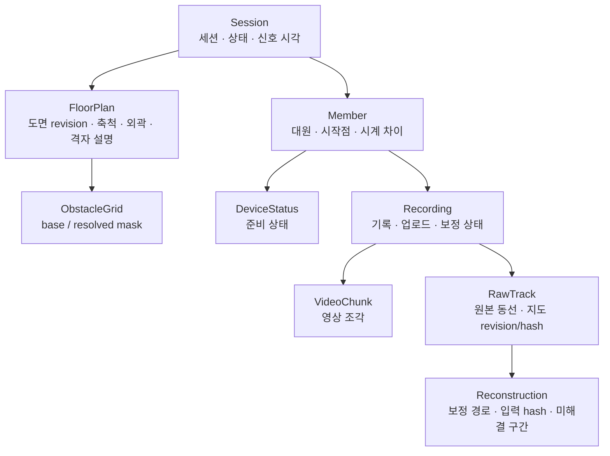

# 공통 데이터 계약 이력 — 2026-10-09 정리 전

> 이 파일은 **과거 검토안 보존 및 담당자 논의용**이다. 아래 원문에 “확정”, “필수”, “검증한다”라는 표현이 있어도 현재 계약으로 적용하지 않는다. 현재 기준은 [양쪽 앱 공통 데이터 계약](../shared-data-contract.md)이다. 보존본의 코드/경로/정책으로 본문을 덮어쓰지 않는다.

## 협업 확인 항목

현재 도면 전달을 막지 않도록 상세 미확정 사항을 본문에서 분리했다. 담당자 확인 후 해당 기준을 본문/공통 코드에 반영하며, 이 목록만으로 #14의 동선 작업을 완료 처리하지 않는다.

| 항목 | 검토 주도 | 현재 취급 |
| --- | --- | --- |
| raw/StartPose/보정 결과의 상세 schema·날짜·enum·상태·시간 정렬 | 아이폰 + AAR | 아래 Swift 선언은 검토 재료. 교관 담당자 단독 확정 아님 |
| 세션 내 기록 재시작·recordingID·복수 raw | 아이폰 + 제품 합의 | 세션당 훈련 한 번과 기록 파일 수는 별개. 복수 기록 지원 자동 확정 금지 |
| 추적 복구·AR 원점 변경·카메라 안정화 | 아이폰 | 같은 원점 복구와 새 원점 재설정을 구분. 0도/첫 직진으로 임의 대체하지 않음 |
| 경로 선분·셀 경계·모서리 충돌 검사 | 아이폰 보정 + AAR | 이번에 보류. 선분 비관통은 현재 완료 보장 아님 |
| 결과 공개 전 raw 업로드 필요 여부 | 아이폰 + 서버 | 선행 조건은 제안. Fixture에는 검증된 raw 참조를 사전 등록해 조건부 시나리오 시험 가능 |
| 결과 publish/select/조회와 경쟁 갱신 | 아이폰 + 서버 + AAR | 아래 상세 API는 검토안. 도면 revision 변경 API와 구분 |
| 실제 저장 경로·권한 규칙·AAR 보존·익명 계정 복구 | 서버 + 제품 합의 | 본문의 소유/접근 경계를 만족하도록 별도 구현·검토 |
| 이미지 용량·해상도·메모리 최적화 | 교관 + 아이폰 | 사용자가 후속으로 미룸. 기존 40MiB 입력/4096px 유지 |

### 용량 논의 이력

- PNG 전달 상한 80MiB와 manifest 1MiB가 제안되어 사용자 확인을 받았다.
- 이후 사용자는 이미지 크기·용량 검토를 후속으로 미뤘다. 80MiB를 현행 코드의 제한이나 새 성능 보장으로 적용하지 않는다.
- 4096×4096 RGBA 한 벌의 64MiB는 디코딩 픽셀 크기이며 PNG 파일 크기나 전체 처리 메모리가 아니다.
- manifest 1MiB는 본문의 파일 검증 기준안에 남겨 두며 아직 공통 코드에 구현된 값이 아니다.

## 정리 전 문서 원문

아래는 정리 전 문서 전체다. 이동에 따른 상대 링크만 조정했다.

---

# 양쪽 앱 공통 데이터 계약 — 도면 전달·동선 보정 검토안

상태: **초기 제품 정책은 팀 합의로 전달받았고, 추가 소유권·시작 방향·세션 고정 정책은 사용자 수락을 반영했다. 기술 선언은 팀 검토안이며 공통 코드 미구현 상태** (2026-10-09).

두 앱이 함께 사용하는 계약이므로 루트 `docs/`에서 관리한다. [공통 아키텍처](../architecture.md)와 [교관 앱 현재 흐름](../../CQB/InstructorApp/docs/flows.md)을 함께 참고한다.

작업 이슈는 [#14 — 도면·동선 공통 계약 확정 및 Fixture 검증](https://github.com/DeveloperAcademy-POSTECH/2026-C6-M15-WFFMST/issues/14), 브랜치는 `schema/14-floorplan-contract`이다. 이슈 #8의 로컬 등록 구현과 분리해 `develop`에서 시작한다. 이 문서는 아직 `CQBCore`에 구현된 계약이 아니며 아래 Swift 선언도 검토안이다. 팀 동의와 변경 기록을 거쳐 공통 모델·서비스·Fixture를 구현하고 호환성을 검증한다.

## 1. 확정된 제품 정책과 범위

사용자가 처음에 팀 합의 완료로 전달한 사항:

1. 도면은 세션 생성 전에 등록하고 여러 훈련 세션에서 재사용한다.
2. 기존 훈련은 당시 도면 버전을 유지한다. MVP에는 등록 도면 수정·삭제 UI가 없다.
3. 훈련 중 도면을 바꿀 수 없다.

추가 논의에서 사용자가 수락한 정책:

4. 별도의 회원가입·로그인 화면 없이 Firebase 익명 인증을 사용한다. 도면을 등록한 익명 UID가 소유하고, 그 UID가 여러 세션에서 재사용한다. 대원은 참가한 세션에 연결된 도면만 읽는다.
5. 대원 시작 방향은 **촬영 시작 카메라 방향**을 기준으로 한다. 첫 직진 방향을 사용하지 않는다.
6. 세션의 도면은 **세션 생성 시부터 고정**한다. 생성 전 화면에서는 선택할 수 있지만 생성 후 바꾸려면 새 세션을 만든다.

도면은 세션에 종속된 소유물이 아니라 **독립된 등록 자원**이고, 세션은 확정된 도면 revision을 참조한다. 화면에서 뒤로 갈 수 없다는 것만으로 잠금이 보장되지는 않는다. Store·서비스와 향후 서버 권한 검사에서도 생성 이후 모든 상태에서 참조 변경을 거부해야 한다. 위 제품 결정과 기술 계약의 3명 검토·변경 기록 완료는 구분한다.

### 목적

교관 앱이 만든 확정 도면을 대원 앱이 같은 좌표·축척·장애물 의미로 읽어, 시작 위치·방향 설정과 자신의 동선 보정에 사용할 수 있게 한다. Firebase 구축이나 보정 알고리즘 자체의 구현은 이 계약 작업의 목적이 아니다.

### 이번 계약 PR에 포함할 작업 (제안)

- [ ] 좌표·축척·격자·revision·전달 파일 규칙을 팀과 확정한다.
- [ ] 확정 도면 모델과 저장·조회·세션 연결 프로토콜을 `CQBCore`에 추가한다.
- [ ] 같은 도면 모델을 사용하는 원본 기록·보정 입력·픽셀 좌표 결과·결과 저장/조회 선언을 통일한다.
- [ ] `CQBFixtures`에 비대칭 테스트 도면과 정상/손상/버전 불일치 데이터를 추가한다.
- [ ] 파일 검증, 좌표 변환, 축척, 세션 참조 잠금 및 재시도 계약을 테스트한다.
- [ ] 양쪽 담당자가 동일 Fixture의 좌표와 장애물 판정을 확인한다.
- [ ] 합의 내용과 미결정 항목을 문서 및 팀 변경 기록에 남긴다.

앱의 기존 `Local*` 모델 연결, Firebase 저장·권한 규칙 구현, 실제 두 기기 통신, 보정 알고리즘 이관, 도면 상세/수정/삭제, 작업본 영속 저장은 후속 구현으로 분리한다.

## 2. 추출·편집·보정의 입출력

| 처리 | 입력 | 하는 일 | 출력 |
| --- | --- | --- | --- |
| 이미지 정규화 | 선택한 PNG/JPEG | 방향 보정, 최대 4096px, 투명 영역 흰 배경 합성 | 정규화 PNG와 RGBA 픽셀 |
| 장애물 자동 추출 | 정규화 픽셀 | PoC의 명암·색·선 밀도 규칙으로 장애물 후보 판정 | base 격자 (초안) |
| 사용자 편집·확정 | base, 순서 있는 막기/열기 획, 실내 외곽 | 획 순서대로 적용한 뒤 외곽 밖을 차단 | resolved 격자 |
| AR 설정 | 도면 표시, 축척, 최종 격자, 사용자 입력 | 시작 위치·방향 지정 및 유효성 검사 | 대원별 StartPose |
| 동선 보정 | 해당 대원의 원본 이동·시간·추적 구간, StartPose, 축척, 최종 격자 | 원본을 지도 좌표로 변환하고 지도 제약을 만족하는 경로 후보 탐색 | 보정 경로, 품질·미해결 구간·입력 식별 정보 |

보정은 단순히 벽 안의 점을 가장 가까운 빈 칸으로 옮기는 처리가 아니다. PoC는 이동 순서와 경로 형태, 장애물 제약을 함께 사용하며 일부 구간은 해결되지 않을 수 있다. 자동 추출 결과도 벽/가구/문자를 완벽히 구별하지 않으므로 교관의 검수를 전제로 한다.

### 대원에게 전달할 지도 입력 (제안)

| 자료 | 목적 | 전달 |
| --- | --- | --- |
| `original.png` | 도면 표시와 시작 위치·방향 지정 | 필요 |
| `resolved-mask.bin` | 시작점·이동 경로의 통과 가능 여부 판정 | 필요 |
| `navigation-map.json` | 이미지/격자 크기, 축척, 외곽, 좌표계, 버전, 파일 hash 해석 | 필요 |
| 세션의 도면 참조 | 정확한 도면·revision·manifest hash 지정 | 필요 |
| base 격자, 편집 획, PKDrawing, 미리보기 | 교관 편집 과정 | 불필요 |
| 자신의 raw/StartPose | 기록과 보정 입력 | 아이폰에서 생성. 보정을 위해 재다운로드할 필요 없음 |
| 세션 시작 시각·시계 차이 | 보정 결과의 AAR 공통 시간 정렬 | 기존 세션/기록 계약으로 제공 |

보정기는 원본 PNG를 다시 분석하지 않는다. 최종 격자와 메타데이터를 사용한다. 지도 파일은 revision/hash 단위로 검증·캐시하며, 다운로드 실패 시 다른 revision이나 임의의 빈 격자로 대체하지 않는다.

### 기기별 책임

- 아이패드: 도면 정규화·장애물 확정·축척 설정 후 지도 입력 발행.
- 아이폰: 지도에서 시작점 지정, 촬영 시작 시 카메라 기준 방향 확보, AR 이동(m)을 도면 좌표(px)로 변환하고 자신의 동선을 보정. 교관이 설정한 축척을 받으며 대원에게 다시 입력시키지 않는다.
- 아이패드 AAR: 같은 revision의 도면과 보정 결과를 조회해 화면 크기·확대율에 맞춰 표시. 기본 흐름에서 AR 좌표 변환·보정을 재실행하거나 축척을 결과에 다시 곱하지 않는다.
- 공통 계산 코드는 `CQBCore`, 가짜 입출력은 `CQBFixtures`, 서버 입출력은 `CQBFirebase`의 책임이다. 공통 코드를 두 앱이 참조한다고 양쪽에서 동일 보정을 반복 실행하는 것은 아니다.

## 3. 좌표·단위 권장안

현재 `LocalFloorPlanGeometry`의 계산을 유지하되, **정규화 좌표와 픽셀 좌표를 서로 다른 타입으로 구분**한다. 앱 내부 편집 좌표는 그대로 두고 공통 계약으로 내보내는 경계에서 명시적으로 변환한다.

| 데이터 | 권장 단위 | 이유 |
| --- | --- | --- |
| 편집 획·외곽 | 0...1 정규화 좌표 | 현재 편집 구현과 일치, 화면 확대에 독립적 |
| 공통 축척 A/B, 시작점·방향점, 보정 결과 | 정규화 PNG 기준 연속 픽셀 좌표 | PoC의 MapSetup/보정 입력과 일치, m→지도 변환이 명시적 |
| 원본 이동 | 기록 시작 원점 대비 AR X/Z의 m | 화면·이미지 해상도와 독립 |
| 격자 | 정수 column/row | 이진 파일과 충돌 판정에 직접 대응 |

이미지 원점은 왼쪽 위, 오른쪽 +x, 아래쪽 +y다. SwiftUI pt, 화면 확대율, 업로드 전 이미지 크기는 저장 좌표에 사용하지 않는다.

```text
pixelX = normalizedX × imageWidth
pixelY = normalizedY × imageHeight
pixelsPerMeter = hypot(B.x - A.x, B.y - A.y) / meters

columns = ceil(imageWidth / cellSizePixels)
rows    = ceil(imageHeight / cellSizePixels)
column  = floor(pixelX / cellSizePixels)
row     = floor(pixelY / cellSizePixels)
index   = row × columns + column
```

- 현재 기본 `cellSizePixels = 2`를 유지하되 파일에 저장하고 소비자가 2를 하드코딩하지 않는다.
- 격자는 행 우선 UInt8, 0=free, 1=blocked, 길이는 정확히 columns×rows다. 수신 시 크기·곱셈 한도·값을 검증하고 메모리를 할당한다.
- 정규화 1은 이미지의 오른쪽/아래 경계다. 외곽·축척 정의에는 경계점을 허용하되, 충돌 조회는 `0 <= x < width`, `0 <= y < height` 밖이면 blocked다. 시작점을 가장자리 안쪽으로 몰래 clamp하지 않는다.
- 현재 코드처럼 홀수 크기 이미지의 마지막 셀 중심이 이미지 범위 밖이면 blocked다. 외곽 판정도 셀 중심 기준이며 모든 획 적용 후 수행한다. 외곽 선분 위의 셀 중심은 내부로 처리한다.
- 소비자는 교관의 resolved 격자를 재생성하지 않는다. 붓 rasterization의 세부 규칙 변경은 생성기 버전과 새 revision으로 식별한다.
- 현재 등록 검증의 최소 10px, 실제 거리 0 초과 1000m 이하, 외곽 3~512점을 유지하는 안을 권장한다. 이는 **현재 앱 구현값을 공통으로 채택하자는 제안**이지 팀 확정값은 아니다.

예: 1000×600 이미지에서 정규화 A=(0.1, 0.2), B=(0.3, 0.2)는 픽셀 A=(100,120), B=(300,120)이다. 실제 거리가 10m이면 20px/m이다. 셀 크기 2px이면 500×300셀이고 픽셀 (100,120)은 (column:50,row:60), 배열 index 30050이다.

### 촬영 시작 카메라 방향 적용

PoC `ARCaptureView`는 `relativeMeters=(AR.x-origin.x, AR.z-origin.z)`를 기록한다. `RouteHeading.rotation`은 지도에서 지정한 방향각에서 AR 기준 방향각을 빼서 회전각을 만든다. 지도 방위와 AR→지도 변환각은 서로 다른 값이다.

```text
theta = atan2(direction.y-start.y, direction.x-start.x) - arReferenceRadians
mapX = start.x + pixelsPerMeter × (cos(theta) × dx - sin(theta) × dz)
mapY = start.y + pixelsPerMeter × (sin(theta) × dx + cos(theta) × dz)
```

도면 기준 방향만 지정해서는 AR 축과 정렬되지 않는다. 원본 기록에 실제 적용한 회전각과 방향 기준 모드를 함께 남긴다. 제품 모드는 `cameraAtRecordingStart`로 결정했다. PoC `MapSetup`의 `firstWalk` 기본값을 그대로 이관하지 않는다. AR 기준 방향은 카메라 전방 벡터를 X/Z 평면에 투영해 얻고, 위 theta를 도 단위 0 이상 360 미만으로 정규화해 저장한다. 카메라 방향과 AR 원점은 같은 촬영 시작 기준에서 확보한다.

안정된 카메라 방향을 얻지 못하면 시작 준비를 완료하지 않고 재설정/대기 안내를 한다. 임의로 0도를 쓰거나 첫 직진 모드로 몰래 바꾸지 않는다. 안정화 샘플 수·시간·허용 흔들림의 수치는 대원 구현에서 측정 후 합의할 기술 항목으로 남긴다.

## 4. 도면 ID·revision·hash 권장안

- `floorPlanID`: 재사용하는 도면의 식별자(UUID).
- `revisionID`: 이미지·최종 격자·축척·외곽이 고정된 버전의 식별자(UUID). 최초 등록부터 발급한다.
- MVP에는 수정 UI가 없어 도면마다 revision 하나로 시작한다. 이력 조회 기능을 먼저 만들 필요는 없다.
- 수정 기능이 생겨도 확정 파일은 덮어쓰지 않는다. 새 revision을 발급하며 이전 세션·기록의 참조는 바꾸지 않는다.
- 세션, StartPose, raw, 보정 결과는 같은 `FloorPlanReference`를 사용한다. 단순히 도면 ID로 "최신 버전"을 다시 조회하지 않는다.
- ID는 첫 등록 요청 전에 생성해 재시도에 재사용한다. 같은 요청 ID·같은 내용은 같은 결과를 반환하고, 같은 ID·다른 내용은 충돌로 거부한다.

### 파일 hash 규칙 제안

`navigation-map.json`을 전달용 메타데이터의 기준으로 삼고 이미지/격자 hash, 축척·외곽·크기·좌표계를 모두 담는다. 기존 예시에서 빠진 축척·외곽을 반드시 포함한다. Firestore의 목록 메타데이터는 검색·목록용 요약이며 계산 입력의 별도 정답이 아니다.

- `imageSHA256`: 저장하는 `original.png`의 정확한 바이트에 SHA-256, 소문자 64자리 hex.
- `maskSHA256`: 저장하는 `resolved-mask.bin`의 정확한 바이트에 같은 방식 적용.
- `navigationSHA256`: 확정한 `navigation-map.json`의 **정확한 UTF-8 바이트**에 같은 방식 적용. 이 값은 JSON 자신 안에는 넣지 않고 외부 `FloorPlanReference`에 둔다(자기 참조 방지).
- 수신자는 내려받은 JSON 바이트의 hash를 먼저 확인한 뒤 decode한다. decode→재encode 결과로 비교하지 않는다. 키 순서·공백이 달라도 의미가 같은 JSON을 동일 hash라고 간주하지 않는다.
- 발행자는 최초 생성한 JSON 바이트를 재시도에도 재사용한다. 유한한 숫자만 허용하고 ID 문자열·인코딩 설정을 공통 writer 한 곳에서 관리한다.
- 이는 PoC의 문자열 헤더+격자 hash와 **다른 새 제안**이다. PoC 기록을 그대로 읽는다면 별도 버전/변환 경로가 필요하다. 기존 hash와 호환된다고 가정하지 않는다.

이 방식을 권장하는 이유는 모든 소비자가 좌표·축척·파일 조합을 한 번에 식별하고, JSON 숫자의 재인코딩 차이로 불일치하는 문제를 피할 수 있기 때문이다. hash는 무결성 검증이며 접근 권한을 대신하지 않는다.

## 5. 저장 위치와 접근 권한

합의된 재사용 정책에 따라 기존 `sessions/{sessionId}/floorplans/...`를 도면의 유일한 원본 위치로 사용하는 안은 수정해야 한다.

권장 논리 구조는 **도면 라이브러리 → 확정 revision → 파일**, **세션 → FloorPlanReference**다. 세션 생성 때 도면 원본 전체를 복제하지 않고 참조한다.

**소유 정책:** 등록 요청의 인증된 익명 UID를 `ownerUID`로 기록한다. 도면명·ID를 보내는 클라이언트가 소유자를 임의로 지정하거나 바꿀 수 없게 한다. 세션의 생성 UID는 선택 도면의 ownerUID와 일치해야 한다. 대원 읽기는 서버가 확인한 세션 참가 관계와 세션의 고정 참조를 기준으로 허용한다. 익명 UID는 사람의 실제 교관 자격이나 기기 고유 ID가 아니다.

구체적인 Firestore/Storage 경로 문자열과 보안 규칙은 위 소유 정책을 만족하도록 서버 담당자와 확정한다. 공통 프로토콜에는 경로 문자열이나 Firebase 타입을 노출하지 않는다. 조직 전체 공유는 현재 범위가 아니며, 다른 기기 이전·기존 익명 계정 접근 상실 시 복구·보존 정책은 별도 확인 항목이다.

- 교관은 권한 있는 라이브러리만 목록·등록할 수 있다.
- 대원은 참가 권한이 확인된 세션의 지정 revision만 읽는다. ID를 아는 것만으로 전체 라이브러리 조회·다른 파일 읽기를 허용하지 않는다.
- 기존 세션 기록의 도면 읽기 권한/보존 기간은 세션·AAR 접근 정책과 함께 확정한다.
- 파일 업로드와 메타데이터 기록은 시스템 전체에서 단일 원자 작업이라고 가정하지 않는다. 모든 파일 검증 이후 ready로 공개하고, 중간 실패한 revision은 목록·세션 선택에서 제외한다.
- 시간 초과는 서버 저장 실패가 확정됐다는 뜻이 아니다. 동일 요청으로 결과를 복구할 수 있어야 한다. 미완료 업로드의 정리 정책은 Firebase 구현 이슈에서 정한다.

## 6. 사용자 행동 → 서비스 계약

아래는 프로토콜 검토안이다. 인증된 사용자 문맥은 구현체에 주입하며, 호출자가 넘긴 ID만으로 권한을 인정하지 않는다.

| 행동 | 입력 | 성공 결과 | 실패 시 처리 |
| --- | --- | --- | --- |
| 교관 도면 등록 | 요청 ID, 도면명, reference, PNG/manifest/격자 바이트 | 검증·공개 완료된 도면 요약 | draft 유지. 일시 오류는 동일 요청 재시도, 손상/버전/권한 오류는 안내 후 중단 |
| 교관 도면 목록 | 페이지 크기·불투명 cursor | 권한 있는 ready 도면 요약과 다음 cursor | 기존 목록 유지, 재조회 제공. 실패를 빈 목록으로 표시하지 않음 |
| 교관 확정 도면 로드 | reference, library 읽기 문맥 | 검증된 metadata·PNG·격자 | 해당 도면 선택 차단. 다른 버전으로 자동 대체하지 않음 |
| 세션 생성 | 세션 요청 ID·이름·선택한 reference | reference가 함께 기록된 세션 | 검증/생성 실패 시 시작 불가. 선택한 도면은 유지하고 재시도 |
| 생성 후 다른 도면 사용 | 새 세션 요청 ID·이름·다른 reference | 다른 도면을 참조하는 새 세션 | 기존 세션의 참조는 유지. 기존 세션을 몰래 수정하거나 삭제하지 않음 |
| 대원 세션 도면 받기 | sessionID → 세션 reference → 세션 읽기 문맥 | 같은 reference의 검증된 지도 | 준비 완료 보고 금지. 네트워크 재시도/손상 캐시 재수신, 불일치 지속 시 중단 |
| 대원 시작 위치·방향 지정 | 검증된 지도, 사용자 점, AR 기준 방향 | reference를 포함한 StartPose | 시작점 blocked/방향 불명확이면 재설정. 임의 보정으로 통과시키지 않음 |
| 대원 보정 | 자신의 raw·StartPose, 같은 지도, 시간 offset | 상태·구간 품질을 포함한 보정 결과 | 입력 불일치는 실행 거부. 추적 단절/일부 미해결은 결과 상태로 표시, raw 보존 |
| 대원 보정 결과 발행 | 요청 ID·고정된 결과 JSON 바이트 | 검증·저장된 결과 참조 | 로컬 결과 유지. 동일 ID/바이트로 재시도, 저장 완료 전 AAR에 공개하지 않음 |
| AAR에 사용할 결과 선택 | 결과 참조·예상한 기존 선택 ID | 조건부로 갱신된 선택 결과 참조 | 경쟁 갱신은 거부 후 최신 선택 조회. 늦은 작업이 자동으로 덮어쓰지 않음 |
| 교관 AAR 조회 | sessionID·memberID → 선택 결과 참조 | 같은 지도·대원의 검증된 픽셀 좌표 결과 | 미완료와 실패를 구분해 표시. 불일치한 결과를 임의의 도면 위에 그리지 않음 |

도면 등록은 세션을 만들거나 수정하지 않는다. 시작 위치/보정 계산은 Repository가 아니라 공통 계산 모듈의 책임이다. 생성 후 도면을 바꾸는 메서드는 제공하지 않는다. 결과 발행·선택·조회는 아래 기술 검토안이며, 실제 재보정/결과 선택 UI를 이번 작업에 추가한다는 뜻은 아니다.

### 공통 모델·프로토콜 초안

다음은 Foundation만 사용하는 선언 초안이다. `Codable` 선언만으로 유효성 검증·불변 저장·권한 검사가 구현되는 것은 아니다. 생성/읽기 경계의 validator와 구현체 테스트가 별도로 필요하다.

```swift
import Foundation

public struct ImagePoint: Codable, Hashable, Sendable {
    public let x: Double
    public let y: Double
}
public struct NormalizedPoint: Codable, Hashable, Sendable {
    public let x: Double
    public let y: Double
}
public struct MapScale: Codable, Hashable, Sendable {
    public let a: ImagePoint
    public let b: ImagePoint
    public let meters: Double
}
public struct FloorPlanReference: Codable, Hashable, Sendable {
    public let floorPlanID: UUID
    public let revisionID: UUID
    public let navigationSHA256: String
}
public struct NavigationGridDescriptor: Codable, Hashable, Sendable {
    public let columns: Int
    public let rows: Int
    public let cellSizePixels: Int
    public let encoding: String // v1: uint8-row-major
    public let freeValue: UInt8 // 0
    public let blockedValue: UInt8 // 1
    public let outsideIsBlocked: Bool // true
    public let maskSHA256: String
}
public struct FloorPlanManifest: Codable, Sendable {
    public let schemaVersion: Int
    public let floorPlanID: UUID
    public let revisionID: UUID
    public let coordinateSystem: String // image-top-left-row-major
    public let imageWidth: Int
    public let imageHeight: Int
    public let imageSHA256: String
    public let scale: MapScale
    public let indoorOutline: [NormalizedPoint]
    public let navigationGrid: NavigationGridDescriptor
    public let extractionAlgorithmVersion: String
    public let rasterizationVersion: Int
    public let manuallyReviewed: Bool
    // navigationSHA256은 포함하지 않는다. 이 JSON 바이트의 hash는 외부 참조에 둔다.
}
public struct FloorPlanSummary: Codable, Sendable {
    public let reference: FloorPlanReference
    public let name: String
}
public struct FloorPlanFiles: Sendable {
    public let imagePNG: Data
    public let navigationMapJSON: Data
    public let resolvedMask: Data
}
public struct PublishFloorPlanRequest: Sendable {
    public let requestID: UUID
    public let reference: FloorPlanReference
    public let name: String
    public let files: FloorPlanFiles
}
public struct FloorPlanPageRequest: Sendable {
    public let limit: Int
    public let cursor: String?
}
public struct FloorPlanPage: Sendable {
    public let items: [FloorPlanSummary]
    public let nextCursor: String?
}
public enum FloorPlanReadContext: Sendable {
    case library
    case session(UUID)
}
public struct ValidatedFloorPlan: Sendable {
    public let reference: FloorPlanReference
    public let manifest: FloorPlanManifest
    public let imagePNG: Data
    public let resolvedMask: Data
    // Production implementation restricts construction to the validator.
}
public protocol FloorPlanRepository: Sendable {
    func publish(_ request: PublishFloorPlanRequest) async throws -> FloorPlanSummary
    func list(_ request: FloorPlanPageRequest) async throws -> FloorPlanPage
    func load(_ reference: FloorPlanReference,
              context: FloorPlanReadContext) async throws -> ValidatedFloorPlan
}

// 도면 연결 관점의 최소 세션 생성 입력. PIN/참가 등 전체 세션 계약은 별도 검토.
public struct CreateTrainingSessionRequest: Sendable {
    public let requestID: UUID
    public let name: String
    public let floorPlan: FloorPlanReference
}
public struct SessionFloorPlanBinding: Codable, Sendable {
    public let sessionID: UUID
    public let floorPlan: FloorPlanReference
}
public protocol SessionFloorPlanRepository: Sendable {
    func createSession(_ request: CreateTrainingSessionRequest) async throws -> SessionFloorPlanBinding
    func binding(for sessionID: UUID) async throws -> SessionFloorPlanBinding
}
public enum FloorPlanServiceError: Error, Sendable {
    case invalidInput(String)
    case unsupportedSchema(Int)
    case unsupportedEncoding(String)
    case integrityMismatch
    case referenceMismatch
    case notFound
    case notReady
    case accessDenied
    case conflict
    case sessionLocked
    case temporarilyUnavailable
}
```

프로덕션 코드에서는 공개 생성자/검증 factory, 오류의 사용자 표시 매핑, 취소(`CancellationError`), 지원하지 않는 좌표계/격자 인코딩의 명시적 거부를 함께 구현한다. 의미를 모르는 장애물 값을 free로 fallback하지 않는다. 세션 생성의 requestID도 재시도에 재사용한다.

`SessionFloorPlanRepository`는 논의를 위한 최소 경계다. 기존/후속 `SessionRepository`가 확정되면 생성·참조 조회 기능을 그 프로토콜로 합치고 이중 서비스로 두지 않는다. 현재는 공통 세션 프로토콜이 구현되어 있지 않다. 세션 최초 생성 시 reference를 함께 기록하고 이후 수정은 거부한다. 기존 요청 ID로 다른 도면을 지정하는 재시도도 충돌로 거부한다.

### 6.1 원본 기록·보정 입력·결과의 단일 정의

이 절은 문서 뒤의 **이전 `FloorPlan` 기반 보정 초안을 대체하는 현재 검토안**이다. 보정 입력은 6절의 `ValidatedFloorPlan`을 그대로 사용하고, 축척은 `floorPlan.manifest.scale`, 충돌 입력은 `floorPlan.resolvedMask`와 `manifest.navigationGrid`에서 얻는다. 별도 축척 입력이나 이전 `FloorPlan` 모델을 혼용하지 않는다.

```swift
public struct MeterPoint: Codable, Hashable, Sendable {
    public let x: Double // AR X의 기록 시작점 대비 m
    public let y: Double // AR Z의 기록 시작점 대비 m (높이 AR Y가 아님)
}
public enum DirectionReferenceMode: String, Codable, Sendable {
    case cameraAtRecordingStart
}
public struct StartPose: Codable, Sendable {
    public let floorPlan: FloorPlanReference
    public let start: ImagePoint
    public let directionPoint: ImagePoint
    public let directionMode: DirectionReferenceMode
    public let cameraDirectionRadians: Double // 촬영 시작 AR X/Z 평면 기준
    public let arToMapRotationDegrees: Double // 0 이상 360 미만
}
public enum TrackingState: String, Codable, Sendable {
    case normal, initializing, excessiveMotion, insufficientFeatures
    case relocalizing, notAvailable, limited, unknown
}
public struct RawSample: Codable, Sendable {
    public let time: TimeInterval // 기록 시작 기준 초
    public let arTimestamp: TimeInterval // 같은 기기의 AR 프레임 시각
    public let arPosition: [Float] // 유한한 원본 [x, y, z](m), 정확히 3개
    public let relativeMeters: MeterPoint? // 추적 유효하지 않으면 nil
    public let trackingState: TrackingState
    public let segment: Int // 추적 단절 전후 구분, 단절을 직선으로 연결하지 않음
}
public struct RawTrack: Codable, Sendable {
    public let schemaVersion: Int
    public let sessionID: UUID
    public let memberID: UUID
    public let floorPlan: FloorPlanReference
    public let startPose: StartPose
    public let recordingStartedDeviceAt: Date
    public let clockOffsetToServer: TimeInterval // 서버 시각 - 기기 시각(초)
    public let captureAlgorithmVersion: String
    public let captureFormatVersion: Int
    public let samples: [RawSample]
}
public struct ValidatedRawTrack: Sendable {
    public let track: RawTrack
    public let sourceRawSHA256: String // 확정 raw.json 원본 바이트의 hash
    // 실제 구현은 decode/검증/hash 계산 factory로만 생성 가능하게 한다.
}
public struct ReconstructionInput: Sendable {
    public let raw: ValidatedRawTrack
    public let floorPlan: ValidatedFloorPlan
    public let sessionStartedAt: Date // 세션에서 받은 서버 기준 시작 시각
}
public enum PointQuality: String, Codable, Sendable {
    case normal, estimated
}
public struct RouteVertex: Codable, Sendable {
    public let t: TimeInterval // 세션 시작 기준 초, AAR 수동 offset 미포함
    public let x: Double // 해당 revision의 정규화 PNG 기준 연속 픽셀 좌표
    public let y: Double // 왼쪽 위 원점, 오른쪽 +x, 아래쪽 +y
    public let part: Int // 같은 part의 연속 점만 연결
    public let sampleIndex: Int? // 원본 대응점, 알고리즘 생성 중간점은 nil 가능
    public let quality: PointQuality
}
public enum UnresolvedReason: String, Codable, Sendable {
    case trackingLost, noValidConnection, searchLimit
}
public struct UnresolvedRange: Codable, Sendable {
    public let fromSampleIndex: Int
    public let throughSampleIndex: Int // 포함되는 끝 index
    public let fromTime: TimeInterval // 세션 기준 초, raw 없이 AAR 구간 표시 가능
    public let throughTime: TimeInterval
    public let reason: UnresolvedReason
}
public enum ReconstructionStatus: String, Codable, Sendable {
    case done, partial, failed // pending은 기록/작업 상태이며 확정 결과 상태가 아님
}
public enum ReconstructionWarning: String, Codable, Sendable {
    case trackingLost, partialSolve, searchIncomplete
    case headingAmbiguous, headingAdjustedSignificantly
}
public struct Reconstruction: Codable, Sendable {
    public let schemaVersion: Int
    public let id: UUID // 보정 실행별 새 ID, 업로드 재시도에는 재사용
    public let sessionID: UUID
    public let memberID: UUID
    public let floorPlan: FloorPlanReference
    public let sourceRawSHA256: String
    public let algorithmVersion: String
    public let engine: String
    public let status: ReconstructionStatus
    public let searchIncomplete: Bool
    public let warnings: [ReconstructionWarning]
    public let vertices: [RouteVertex]
    public let unresolvedRanges: [UnresolvedRange]
}
public protocol Reconstructor: Sendable {
    var algorithmVersion: String { get }
    func reconstruct(_ input: ReconstructionInput) async throws -> Reconstruction
}
```

형식·필드·오류 분류는 기술 검토안이다. 특히 이전 `summary` 중첩 구조를 위의 단일 결과 모델로 정리했으며, `PointQuality.lost` 대신 좌표 없는 `unresolvedRanges`를 사용한다. 이전 파일을 그대로 decode할 수 있다고 가정하지 않는다. 파일 schema 버전과 지원/변환 정책은 계약 PR에서 확정하며 PoC의 captureFormatVersion 15와 공통 raw schemaVersion을 같은 의미로 쓰지 않는다.

### 입력·출력 검증 규칙

- 원본 파일을 정확한 바이트로 확정한 뒤 SHA-256(소문자 64자리 hex)을 계산한다. 동일 바이트를 보정과 업로드의 원본으로 사용하며, hash 계산 후 raw 내용을 변경하지 않는다. `sourceRawSHA256`은 raw 파일 자신 안에 넣지 않는다.
- raw/결과 JSON의 날짜는 공통 encoder에서 ISO 8601 UTC·밀리초 형식으로 처리한다. 모든 숫자는 유한해야 하며, 모르는 enum의 decode 정책은 공통 decoder에서 정의한다. `unknown` case 선언만으로 자동 fallback되는 것은 아니다. 방향 기준/좌표계처럼 해석에 필수인 미지원 값은 입력을 거부한다.
- 세션 고정 참조, raw.floorPlan, raw.startPose.floorPlan, 입력 지도의 reference가 모두 일치해야 한다. manifest의 ID, 실제 이미지·격자 hash와 크기도 검증한다. 도면 불일치는 보정으로 해결할 문제가 아니라 입력 오류다.
- 시작점은 지도 범위 내 free 셀이어야 한다. 방향점은 유효한 이미지 좌표이며 시작점과 충분히 떨어져야 한다. 방향점은 방향 표시용이므로 반드시 free 셀일 필요는 없다. 최소 간격은 PoC의 10px를 제안하며 기술 검토 대상이다.
- 시작 방향 모드는 cameraAtRecordingStart여야 하고, 안정된 카메라 기준 방향과 저장 회전각의 계산 관계를 검증한다. 첫 직진 모드 원본은 조용히 의미를 바꾸지 말고 변환 또는 미지원 오류로 처리한다.
- 원본 샘플은 시간순이고 숫자는 유한해야 한다. 추적 유효하지 않은 샘플은 상대 좌표를 사용하지 않으며, 유효 상대 좌표가 2개 미만이면 보정 입력 오류다. segment 변경이나 추적 단절을 정상 연속 구간으로 합치지 않는다.
- 보정기는 다음 offset을 내부에서 계산한다. 별도 입력값과 중복으로 전달해 서로 다른 값을 사용하지 않는다.

```text
recordingStartOffset = recordingStartedDeviceAt + clockOffsetToServer - sessionStartedAt
vertex.t = recordingStartOffset + 기록 기준 보정점 시각
```

- `vertices`는 도면 픽셀 좌표다. 아이패드는 화면 표시 변환만 적용하며 pixelsPerMeter를 다시 곱하지 않는다. 정상/추정 좌표도 범위·free 셀·같은 part의 연결 가능성을 검사한다. 통과 불가 경로를 성공 결과로 숨기지 않는다.
- 추적이 끊긴 곳에는 `(0,0)` 같은 가짜 점을 넣지 않는다. part를 나누고 원본 index와 세션 기준 시간을 가진 unresolvedRanges를 반환한다. AAR은 서로 다른 part를 연결하지 않는다.
- 입력 손상/미지원/참조 불일치와 취소는 throw로 처리한다. 유효한 입력에서도 일부 경로만 구했으면 partial, 표시 가능한 경로가 없으면 failed, 계약상 미해결 구간 없이 경로를 구했으면 done으로 반환한다. done은 실제 위치 오차가 0임을 보장하지 않는다.
- 탐색 시간 한도로 후보 검사가 끝나지 않았으면 searchIncomplete를 별도로 기록한다. 시간 제한 자체가 곧 failed를 뜻하지 않으며 실제 경로·미해결 상태와 함께 판단한다.
- 결과의 sessionID/memberID/floorPlan/sourceRawSHA256은 입력에서 가져오고, vertices·unresolvedRanges의 index/시간 범위를 검증한다. 보정 알고리즘은 원본 파일을 수정하지 않는다.

### 6.2 결과 반환과 서버 발행·AAR 조회의 경계

`Reconstructor.reconstruct`는 **아이폰 내부 계산 결과 반환**이다. 서버 업로드나 아이패드 전송을 수행하지 않는다. 아이폰은 결과를 로컬에 보관한 뒤 저장 서비스를 호출하고, 아이패드는 서버에서 선택된 결과를 조회한다. 다음 선언은 그 경계의 검토안이다.

```swift
public struct ReconstructionReference: Codable, Hashable, Sendable {
    public let sessionID: UUID
    public let memberID: UUID
    public let resultID: UUID
    public let resultSHA256: String // 저장하는 결과 JSON의 정확한 바이트 hash
}
public struct PublishReconstructionRequest: Sendable {
    public let requestID: UUID
    public let reference: ReconstructionReference
    public let resultJSON: Data
}
public protocol ReconstructionRepository: Sendable {
    func publish(_ request: PublishReconstructionRequest) async throws -> ReconstructionReference
    func select(_ reference: ReconstructionReference,
                expectedSelectedResultID: UUID?) async throws -> ReconstructionReference
    func selectedResult(sessionID: UUID, memberID: UUID) async throws -> ReconstructionReference?
    func load(_ reference: ReconstructionReference) async throws -> Reconstruction
}
```

- publish는 인증된 대원이 자기 기록의 결과만 올리도록 검사한다. request/session/member/result ID와 JSON 내용, 지도 참조·sourceRawSHA256·좌표 형식을 검증한다. 함수에 memberID를 전달했다는 사실만으로 소유권을 인정하지 않는다.
- 확정 raw 업로드와 원본 hash 검증이 선행돼야 결과를 공개할 수 있다. 로컬 보정은 raw 업로드 전에도 가능하지만 raw가 아직 서버에 없으면 결과 발행은 notReady로 실패하고 로컬 결과를 유지해 재시도한다. raw 저장 자체는 기록 서비스의 책임이며 이 Repository에 섞지 않는다.
- 동일 요청/결과 ID·동일 JSON 바이트는 동일 결과를 반환한다. 같은 ID·다른 내용은 conflict다. 결과 파일과 메타데이터를 모두 검증한 뒤 ready로 공개하며, 부분 업로드는 조회/선택 대상이 아니다. resultSHA256은 결과 JSON 자신 안에는 넣지 않는다.
- publish 성공만으로 AAR 선택 포인터를 바꾸지 않는다. select는 ready 결과와 세션/대원/지도/원본 일치를 검사하고 기존 선택 ID가 예상값과 같을 때만 원자적으로 변경한다. 최초 선택은 nil을 기대한다. 같은 결과가 이미 선택돼 있으면 재시도를 성공으로 처리하고, 다른 값으로 바뀌었으면 conflict를 반환한다.
- MVP에서 select는 자기 결과를 등록한 대원의 작업 완료 흐름에서 사용한다. 교관은 세션 소유 권한으로 선택 결과를 조회한다. 재보정/교관 수동 결과 선택 UI는 후속 범위다. 선택 정책을 확장할 경우 권한 규칙도 함께 검토한다.
- selectedResult의 nil은 아직 선택된 결과가 없다는 뜻이며 네트워크 오류를 nil로 숨기지 않는다. load는 결과 hash와 세션 고정 지도 일치를 확인한다. failed 결과도 정상 저장된 결과일 수 있으므로 AAR은 상태와 미해결 구간을 표시한다.
- 저장/조회 오류는 6절의 오류 분류(invalidInput, integrityMismatch, referenceMismatch, notReady, accessDenied, conflict, temporarilyUnavailable)와 취소를 구분한다. 프로덕션 구현 시 도면 전용 오류 이름을 그대로 재사용할지 공통 입출력 오류로 분리할지는 코드 계약 PR에서 결정한다.
- 계산 중·업로드 중·업로드 실패는 작업/Recording 상태이고 결과의 done/partial/failed와 다르다. AAR 전환을 단순히 "로컬 보정 함수가 반환했는가"로 판단하지 않는다.
- 향후 Recording 모델의 선택 필드는 이 ReconstructionReference를 참조한다. `selectedReconstructionID`만 쓰는 기존 초안을 채택한다면, 서버 어댑터가 같은 ID의 resultSHA256·세션·대원 정보를 포함한 참조로 해석해야 한다. 둘을 독립적으로 갱신하지 않는다.

예: 20px/m, 시작점 (100,120), 변환각 0도, 상대 이동 (3,0)m이면 보정 전 위치는 (160,120)px다. 이 위치와 이동 경로가 free이면 결과가 그대로일 수 있고, 장애물 제약이 있으면 보정기는 다른 경로 또는 미해결 상태를 반환한다. 결과 x/y는 이미 px이므로 아이패드에서 20을 다시 곱하지 않는다.

## 7. 완료 조건과 실제 검증 방법

- [ ] 팀원 3명이 기술 제안과 미결정 항목을 검토하고 확정/보류를 기록했다.
- [ ] `CQBCore` 공통 모델·서비스가 컴파일되고 Firebase/SwiftUI에 의존하지 않는다.
- [ ] `CQBFixtures`의 비대칭 지도(좌상단 장애물, 다른 위치 통로)를 양쪽에서 읽어 같은 셀과 방향으로 해석한다.
- [ ] 위 숫자 예시에서 양쪽의 20px/m와 index 30050이 일치한다.
- [ ] 정규화↔픽셀 변환, 홀수 이미지 크기·오른쪽/아래 경계, 외곽 밖 blocked를 검사한다.
- [ ] PNG/manifest/격자 크기·바이트 수·값·hash와 세션/raw/reference 불일치, 미지원 버전을 거부한다.
- [ ] 같은 도면을 두 세션이 참조할 수 있고, 다른 revision이 생겨도 기존 참조는 유지된다.
- [ ] 가짜 서비스에서 등록 실패·재시도·중복 요청·ready 이전 조회 차단·세션 잠금을 재현한다.
- [ ] 세션 생성 이후 준비/훈련/종료 상태 모두에서 도면 참조 변경을 거부하고, 새 세션 생성은 기존 참조에 영향을 주지 않는다.
- [ ] 익명 UID별 도면 목록/등록 권한, 참가 세션의 지도만 읽기, 자기 보정 결과 쓰기·교관 조회를 서비스/서버 어댑터 검증 계획에 포함한다.
- [ ] 촬영 시작 방향 기준으로 AR→지도 좌표 변환을 검증하고, AAR에서 축척을 중복 적용하지 않는 Fixture를 확인한다.
- [ ] 결과의 입력 reference/raw hash, 시간 offset, part 단절, 미해결 시간 구간, done/partial/failed를 검증한다.
- [ ] 결과 발행 실패·중복 재시도·원본 미업로드·선택 포인터 충돌·조회 오류를 가짜 서비스에서 재현한다.
- [ ] 보정 담당자가 map+raw+StartPose+시간 정보로 입력을 구성할 수 있음을 확인한다. 보정 알고리즘 완성/정확도 검증은 별도 이슈다.

위 목록은 앞으로 수행할 완료 조건이다. 문서 안의 선언이 컴파일된다는 것만으로 계약 구현·기기 간 호환 테스트가 완료되지는 않는다.

## 8. 결정 상태와 남은 검토

- 소유 범위는 등록한 익명 UID, 대원 읽기는 참가 세션의 도면으로 결정했다.
- 시작 방향은 촬영 시작 카메라 방향으로 결정했다.
- 도면은 세션 생성 시 고정하며 selectFloorPlan 프로토콜을 제거했다. 결과 선택(select)은 도면 변경이 아니라 같은 입력의 보정 결과 참조 선택이다.

남은 기술/운영 검토:

1. 구체적인 저장 경로·권한 규칙과 계정 접근 상실 시 복구·보존 정책. 도면 소유 정책 자체는 더 이상 미결정이 아니다.
2. 좌표/입력 한도·카메라 방향 안정화 기준·새 manifest/hash 방식·파일 schema 버전 및 기존 PoC 입력 변환 여부.
3. 원본/보정 결과의 선언과 저장·선택·조회 실패 계약을 양쪽 담당자가 검토하고 공통 코드·Fixture로 검증.
4. 영상·전체 세션 상태·AAR 전환 조건은 별도 계약과 대조. 뒤의 과거 초안을 이번 도면·보정 검토로 자동 승인하지 않는다.

검토용 문서 PR은 지금 작성할 수 있지만, 미결정 사항이 있는 동안 이를 확정 계약 구현 완료로 표시하지 않는다. 공통 모델/저장 경로/파일 형식 변경을 실제 코드에 반영하는 PR에는 데이터 계약 영향 체크, 3명 동의와 변경 기록이 필요하다.

## 9. 현재 코드와의 연결 근거

- [로컬 도면 모델](../../CQB/InstructorApp/Models/LocalFloorPlan.swift): 현재 등록 결과에는 이미지·base/resolved·획·외곽·축척이 함께 존재. 이 전체를 전송 모델로 그대로 사용하지 않는다.
- [격자·축척 계산](../../CQB/InstructorApp/Services/Geometry/LocalFloorPlanGeometry.swift): width/height를 곱하는 좌표 변환, 10px/1000m 검증, 외곽 최종 적용.
- [이미지 정규화](../../CQB/InstructorApp/Services/Import/LocalFloorPlanImportService.swift): PNG/JPEG 입력, 방향 보정과 4096px 제한.
- 별도 `floorplanPoC/FloorPlanPoC`의 `ARCaptureView.swift`, `RouteHeading.swift`, `RecordingStore.swift`, `NonrigidRouteMatcher.swift`, `NavigationMapIdentity.swift`를 읽어 입력·방향·hash를 대조했다. 이 소스는 현재 저장소에 포함하지 않는다.

### 이번 검토에서 기존 초안과 달라지는 부분

- 세션 아래에만 존재하는 도면 → 세션과 독립된 라이브러리 및 revision 참조.
- 누락된 축척/외곽 → manifest 필수 입력으로 제안.
- 추상적인 navigation hash → 자기 참조 없는 정확한 파일 바이트 hash로 제안(PoC와 비호환이므로 별도 버전 필요).
- 자동 작업본 저장·재실행 복원 → 이번 최소 계약의 필수 범위에서 제외.
- 서버 구현 위치 `CQBCore/Firebase`, Fixture 위치 `CQBCore/Fixtures` → 실제 패키지의 별도 `CQBFirebase`, `CQBFixtures` 모듈에 대응.
- 첫 직진 방향/준비 중 도면 변경 → 촬영 시작 카메라 방향/세션 생성 시 고정으로 결정.
- 이전 FloorPlan 기반 보정 입력 → ValidatedFloorPlan으로 통일. 결과에는 FloorPlanReference와 원본 hash를 넣고 도면 px 좌표를 명시.
- 보정 함수 반환과 서버 전달 혼동 → 로컬 Reconstructor와 결과 발행·선택·조회 Repository를 구분.
- 입력 데이터가 전부 정의됐다는 기존 설명 → 제품 결정은 반영했지만 기술 schema와 양쪽 호환 테스트는 아직 검토·구현 필요.

### 변경 기록 (현 검토안)

- 2026-10-09: 이슈 #8 이후 작성한 미커밋 계약 초안을 develop 기반 `schema/14-floorplan-contract`로 옮겨 이슈 #14의 작업 범위로 분리. 내용 보존을 확인하고 이전 앱 내부 문서 경로의 빈 파일 스테이징만 정리.
- 2026-10-09: 익명 UID 소유/참가 세션 지도 읽기, 촬영 시작 카메라 방향, 세션 생성 시 지도 고정 반영. 보정 입출력을 최신 도면 모델로 통일하고 결과의 픽셀 좌표·시간·단절·원본 hash 및 발행/조회 경계 정의. 공통 Swift 소스와 Firebase 구현은 변경하지 않음.

---

# 이전 미확정 전체 초안 (원문 보존)

아래는 팀 논의가 중단된 기존 원문이다. **확정 계약이나 이번 구현 지시가 아니다.** 세션 중심 도면 경로, 작업본 자동 복원, 메타데이터 예시, hash 및 모듈 위치는 위 검토안과 충돌하므로 그대로 구현하지 않는다. 도면 외 영상·AAR·인증 내용도 이번 검토에서 승인한 것으로 간주하지 않는다.


## 현재 의도적으로 정의하지 않은 부분

MVP 계약에서는 다음은 아직 상세히 정의하지 않았습니다.

- 여러 iPad가 같은 draft를 동시에 수정할 때의 충돌 병합
- 오래된 draft 자동 삭제 기간
- V13 내부 후보 전체와 상세 점수 저장
- 자동 추출 confidence를 셀마다 저장
- Apple Pencil 압력·기울기 저장
- 편집 획을 여러 기기에서 실시간 공동 편집

따라서 현재 수정본은 “한 교관이 iPad에서 장애물을 편집하고 확정한 뒤, 그 결과로 아이폰 기록과 V13 보정을 수행하는 흐름”에는 필요한 정의가 모두 반영된 상태입니다.

---

아이폰(A), AAR(B), Firebase·아이패드 준비(C) 세 사람이 함께 쓰는 데이터와 코드의 약속이다. 세 부분으로 나눈다.

| 부분 | 무엇을 정하나 | 코드 위치 |
| --- | --- | --- |
| **1. 도메인 모델** | 앱 안에서 쓰는 데이터의 모양. Firebase를 몰라도 된다 | `CQBCore/Models` |
| **2. 저장 방식** | 도메인 모델을 Firestore·Storage에 어떻게 저장하나 | `CQBCore/Firebase` |
| **3. 모듈 인터페이스** | 공통 함수(보정·시간 변환·축척·장애물 판정), 파일 형식, 공통 enum | `CQBCore/Calibration`, `CQBCore/Time`, `CQBCore/FloorPlan` |

확정 후에는 `CQBCore`의 코드가 진짜 계약이고, 이 문서는 그 설명서다.

## 0. 공통 규칙

- **이름:** camelCase. Swift 프로퍼티 이름 = Firestore 필드 이름 = JSON 키.
- **ID:** `UUID`. 저장할 때는 `uuidString`(대문자) 그대로. 만드는 쪽이 발급한다. 예외: PIN은 6자리 숫자 `String`.
- **시각:** 앱 안에서는 `Date`. 어느 시계인지 이름에 드러낸다. 서버 시계는 그냥 `...At`, 아이폰 시계는 `...DeviceAt`.
- **상대 시각:** `TimeInterval`(초). 원본 동선은 기록 시작부터, 보정 동선은 세션 시작(`Session.startedAt`)부터.
- **도면 이미지 좌표:** **Storage에 저장된 리사이즈 완료 PNG 기준 픽셀. 왼쪽 위가 원점이고 오른쪽이 +x, 아래쪽이 +y다. 업로드 전 원본 이미지 좌표는 사용하지 않는다.**
- **정규화 좌표:** **외곽선과 편집 획은 이미지 크기와 무관한 0...1 좌표로 저장한다. 이미지 픽셀 좌표와 암묵적으로 혼용하지 않는다.**
- **장애물 편집 획:** **사용자의 막기·열기 획은 `NormalizedPoint` 배열로 저장한다. 배열 순서가 적용 순서이며, 같은 위치에 여러 획이 겹치면 나중 획이 우선한다.**
- **붓 굵기:** **편집 붓의 굵기는 화면 pt나 이미지 픽셀이 아니라 도면 이미지의 짧은 변에 대한 비율인 `normalizedDiameter`로 저장한다.**
- **편집 입력 재현:** **Apple Pencil의 압력·기울기는 저장하지 않는다. 고정 지름으로 rasterization하며 같은 입력을 같은 셀로 변환할 수 있도록 `rasterizationVersion`을 저장한다.**
- **방향:** **`mapBearingDegrees`는 도면 위쪽 0°, 시계방향 0~360°인 지도 방위다. `arToMapRotationDegrees`는 AR 평면 벡터를 이미지 평면으로 바꾸는 변환각이며 이미지 오른쪽 0°, 아래쪽 90°다. 두 값을 같은 의미로 사용하지 않는다.**
- **enum:** `String` rawValue로 저장한다. 모르는 값이 오면 앱이 죽지 않게 `unknown` 또는 안전한 fallback으로 처리한다.
- **버전:** 저장하는 문서와 파일에 `schemaVersion: Int`를 둔다. **앱 기능 버전, 원본 동선 파일 버전, 보정 알고리즘 버전은 서로 다른 필드로 저장한다.**
- **파일 검증:** **도면 이미지, 최종 장애물 격자, 원본 동선은 SHA-256으로 식별한다. 보정 결과에는 자신이 사용한 원본과 지도의 hash를 함께 저장한다.**

---

# 1부. 도메인 모델

Firebase 타입(`Timestamp`, `DocumentReference` 등)을 쓰지 않는다. 그래서 B는 Firebase 없이 가짜 데이터로 먼저 작업할 수 있다.

**수정된 관계도:**



MVP에는 **Team이 없다.** PIN으로 들어온 사람이 곧 팀이다(P-6).

### 1.1 도면

도면 및 오차 보정에 대하여…

**변경: 픽셀 좌표, 정규화 좌표, 격자 좌표를 분리한다.**

```swift
/// 저장된 도면 이미지 기준 픽셀 좌표.
/// 왼쪽 위가 원점이고 오른쪽이 +x, 아래쪽이 +y다.
public struct ImagePoint: Codable, Hashable {
    public var x: Double
    public var y: Double
}

/// 이미지 크기와 무관한 0...1 정규화 좌표.
/// 외곽선과 편집 획에 사용한다.
public struct NormalizedPoint: Codable, Hashable {
    public var x: Double
    public var y: Double
}

/// 장애물 격자의 한 칸.
public struct GridCell: Codable, Hashable {
    public var column: Int
    public var row: Int
}

/// 기록 시작 원점 기준 AR X/Z 평면 이동(m).
public struct MeterPoint: Codable, Hashable {
    public var x: Double
    public var y: Double
}

/// 축척. 도면 위 두 점과 그 사이의 실제 거리 (P-3, V13 MapSetup)
public struct MapScale: Codable, Hashable {
    public var a: ImagePoint
    public var b: ImagePoint
    /// a와 b 사이의 실제 거리(m). 0보다 커야 저장할 수 있다.
    public var meters: Double
}
```

**변경: 최종 장애물은 도면과 같은 크기의 PNG가 아니라, 크기와 셀 해상도를 명시한 이진 격자로 정의한다.**

```swift
/// resolved-mask.bin의 배열 형식과 크기.
public struct NavigationGridDescriptor: Codable, Hashable {
    /// 격자 가로/세로 칸 수
    public var columns: Int
    public var rows: Int

    /// 한 격자 칸의 한 변이 차지하는 이미지 픽셀 수. PoC 기본값은 2.
    public var cellSizePixels: Int

    /// 지금은 "uint8-row-major"
    public var encoding: String

    /// 지금은 free=0, blocked=1
    public var freeValue: UInt8
    public var blockedValue: UInt8

    /// 이미지 밖과 실내 외곽 밖을 통과 불가로 처리한다.
    public var outsideIsBlocked: Bool

    /// resolved-mask.bin의 SHA-256
    public var maskSHA256: String
}

/// 자동 장애물 추출에 사용한 방식.
public struct ObstacleExtractionInfo: Codable, Hashable {
    /// 예: "v13-wall-detector-v1"
    public var algorithmVersion: String
    /// 예: "v13", "paleWalls"
    public var profile: String
    public var extractedAt: Date
    /// 사용자가 열기·막기·외곽을 확인했는지
    public var manuallyReviewed: Bool
}

/// 사용자가 장애물 격자를 수정하는 방식.
public enum ObstacleEditMode: String, Codable {
    /// 해당 영역을 통과 불가로 만든다.
    case block
    /// 해당 영역을 통과 가능하게 만든다.
    case open
    case unknown
}

/// Apple Pencil 또는 손가락으로 입력한 장애물 수정 획.
public struct ObstacleEditStroke: Codable, Identifiable, Hashable {
    public let id: UUID
    public var mode: ObstacleEditMode

    /// 입력 순서의 0...1 정규화 좌표
    public var points: [NormalizedPoint]

    /// 도면 이미지의 짧은 변에 대한 붓 지름 비율
    public var normalizedDiameter: Double

    /// 같은 획을 같은 격자 셀로 변환하기 위한 알고리즘 버전
    public var rasterizationVersion: Int
}

/// 아직 확정하지 않은 도면 장애물 편집 작업본.
public struct ObstacleEditDraft: Codable, Identifiable {
    public let id: UUID
    public var floorPlanID: UUID

    /// 기존 확정 revision을 다시 편집할 때 사용한다. 최초 편집이면 nil.
    public var sourceRevisionID: UUID?

    /// 다른 이미지나 base mask에 편집 획이 잘못 적용되지 않게 검사한다.
    public var imageSHA256: String
    public var baseMaskSHA256: String

    /// 배열 순서대로 적용한다.
    public var strokes: [ObstacleEditStroke]

    /// 편집 중인 실내 외곽
    public var indoorOutline: [NormalizedPoint]
    public var updatedAt: Date
}

public enum FloorPlanDraftStatus: String, Codable {
    case editing
    case finalizing
    case finalized
    case abandoned
}

/// 훈련에 쓰는 도면 revision.
public struct FloorPlan: Codable, Hashable, Identifiable {
    public let id: UUID

    /// 이미지·마스크·축척·외곽이 달라지면 새로 발급한다.
    public let revisionID: UUID

    /// 도면/훈련장 명
    public var name: String

    /// Storage에 저장된 실제 PNG 크기(px)
    public var imageWidth: Int
    public var imageHeight: Int

    public var scale: MapScale

    /// 사용자가 지정한 실내 유효 외곽. 외곽 밖은 모두 blocked다.
    public var indoorOutline: [NormalizedPoint]

    public var navigationGrid: NavigationGridDescriptor
    public var extraction: ObstacleExtractionInfo

    /// original.png의 SHA-256
    public var imageSHA256: String

    /// 이미지·최종 마스크·격자 정보·축척을 함께 식별하는 SHA-256
    public var navigationSHA256: String
}
```

**도면 이미지와 장애물 배열 자체는 Firestore 모델에 넣지 않는다. 파일은 Storage의 revision 경로에 저장하고 `FloorPlan`에는 크기·경로를 결정하는 ID·hash·격자 설명만 둔다.**

**장애물의 최종 의미는 벽 객체가 아니라 `resolved-mask.bin`의 값이다. 자동 추출은 벽과 가구선·문자·도면 기호를 완전히 구분하지 못할 수 있으므로 사용자가 검수한 최종 격자를 사용한다.**

**`ObstacleEditDraft`는 편집 중인 작업 데이터이며 확정된 `FloorPlan` revision과 구분한다. `FloorPlan`에는 편집 획을 넣지 않고 사용자 편집과 외곽이 반영된 최종 `resolved-mask.bin`만 연결한다. 편집을 확정할 때마다 새 `revisionID`를 발급하며 기존 확정 revision은 수정하지 않는다.**

### 1.2 세션

```swift
/// 세션 진행 단계. 앞에서 뒤로만 진행한다.
public enum SessionStatus: String, Codable {
    case preparing
    case waiting
    case running
    case ended
}

/// 훈련 1회
public struct Session: Codable, Identifiable {
    public let id: UUID
    public var pin: String
    public var name: String
    public var status: SessionStatus
    public var createdAt: Date
    public var startedAt: Date?
    public var endedAt: Date?
    public var excludedMemberIDs: [UUID]

    /// 준비 단계에서 현재 선택된 도면 revision.
    /// running 이후에는 변경할 수 없다.
    public var activeFloorPlanRevisionID: UUID?

    /// 준비 화면에서 현재 편집 중인 작업본. 확정된 작업본만 있으면 nil.
    public var activeFloorPlanDraftID: UUID?
}
```

**변경: 전체 `FloorPlan`을 Session 문서 안에 중첩 저장하지 않고 `activeFloorPlanRevisionID`로 참조한다. 실제 FloorPlan 메타데이터는 `floorPlanRevisions` 하위 컬렉션에 저장한다.**

**`activeFloorPlanDraftID`는 준비 중인 편집 작업본이고 `activeFloorPlanRevisionID`는 검수·확정된 훈련 입력이다. `running` 상태에서는 draft 내용을 사용하지 않는다.**

### 1.3 대원과 준비 상태

**변경: 방향점이 카메라 방향인지 첫 이동 방향인지 명시하고, 기록에 사용한 도면 revision/hash를 함께 묶는다.**

```swift
public enum DirectionReferenceMode: String, Codable {
    /// 기록 시작 순간 휴대폰 카메라가 향하는 방향
    case cameraAtRecordingStart
    /// 기록 시작 후 처음 직진한 실제 이동 방향
    case firstWalk
    case unknown
}

/// 대원이 도면에 지정한 시작 위치와 방향.
public struct StartPose: Codable, Hashable {
    public var start: ImagePoint
    public var directionPoint: ImagePoint
    public var directionMode: DirectionReferenceMode

    /// AR 평면 벡터를 이미지 평면으로 변환하는 회전각.
    /// 이미지 오른쪽 0°, 아래쪽 90°이며 V13 rotationDegrees와 같은 의미다.
    public var arToMapRotationDegrees: Double

    /// cameraAtRecordingStart 모드에서 기록 시작 직전 안정된 프레임으로 계산한다.
    public var cameraDirectionRadians: Double?

    /// 시작점과 방향점을 지정한 도면 revision
    public var floorPlanRevisionID: UUID
    public var navigationSHA256: String
}

public struct Member: Codable, Identifiable {
    public let id: UUID
    public var name: String
    public var displayName: String
    public var joinedAt: Date

    /// 서버 시계 − 아이폰 시계(초). 아이폰 시각에 더하면 서버 시각이 된다.
    public var clockOffsetToServer: TimeInterval

    /// 아직 지정하지 않았거나 추적 재시작 등으로 무효가 되면 nil.
    public var startPose: StartPose?
}

public struct DeviceStatus: Codable {
    public var memberID: UUID
    public var startPointSet: Bool
    public var trackingReady: Bool
    public var recording: Bool
    public var updatedAt: Date
}
```

**V13 흐름에서는 기록 시작 순간 카메라 위치를 원점으로 잡고 첫 상대 좌표를 `(0, 0)`으로 둔다. 기존 `markedDeviceAt`과 4×4 `arTransform`은 기록 시작 전 이동까지 별도로 계산하는 기능을 구현하지 않는 한 공용 계약에서 제외한다.**

- **마커 번호는 저장하지 않는다.** `displayName` 가나다순으로 매번 계산한다(K3).
- **준비됨**은 3.5의 `ReadinessRule`로 계산한다(G-1).

### 1.4 기록

```swift
public enum EndReason: String, Codable {
    case signal
    case manual
    case error
}

public enum RecordingState: String, Codable {
    case recording
    case uploading
    case done
}

public struct VideoInfo: Codable {
    public var codec: String
    public var width: Int
    public var height: Int
    public var fps: Int
    public var chunkSeconds: TimeInterval
    public var totalChunks: Int?
    public var uploadedChunks: Int
}

public struct VideoChunk: Codable, Identifiable {
    public var index: Int
    public var startSeconds: TimeInterval
    public var durationSeconds: TimeInterval
    public var uploadedAt: Date?
    public var id: Int { index }
}

public enum ReconstructionStatus: String, Codable {
    case pending
    case done
    case partial
    case failed
}
```

**변경: 예시 JSON에만 있던 `algorithmVersion`을 모델에 추가하고, 사용한 원본과 지도 hash 및 탐색 한도 상태를 저장한다.**

```swift
public struct ReconstructionSummary: Codable {
    public var status: ReconstructionStatus

    /// 예: "v13-context-aware-1"
    public var algorithmVersion: String

    /// 예: "contextAware"
    public var engine: String

    /// 입력 재현과 불일치 검사용
    public var sourceRawSHA256: String
    public var floorPlanRevisionID: UUID
    public var navigationSHA256: String

    /// 제한 시간 때문에 모든 후보를 검사하지 못했는지
    public var searchIncomplete: Bool

    public var warnings: [ReconstructionWarning]
    public var finishedAt: Date?
}

public struct Recording: Codable, Identifiable {
    public var memberID: UUID
    public var signalReceivedDeviceAt: Date
    public var recordingStartedDeviceAt: Date
    public var recordingEndedDeviceAt: Date?
    public var endReason: EndReason?
    public var rawUploaded: Bool
    public var video: VideoInfo
    public var reconstruction: ReconstructionSummary

    /// 여러 번 재보정한 경우 AAR에서 사용할 결과
    public var selectedReconstructionID: UUID?

    public var state: RecordingState
    public var id: UUID { memberID }
}
```

### 1.5 동선

**변경: 자유 문자열 추적 상태를 enum으로 바꾸고 V13이 실제 입력으로 사용하는 `relativeMeters`를 원본에 저장한다.**

```swift
public enum TrackingState: String, Codable {
    case normal
    case initializing
    case excessiveMotion
    case insufficientFeatures
    case relocalizing
    case notAvailable
    case limited
    case unknown
}

public struct RawSample: Codable {
    /// 기록 시작부터의 초. 단조 증가한다.
    /// 목표 주기는 0.1초지만 실제 간격은 프레임과 기기 부하에 따라 달라질 수 있다.
    public var time: TimeInterval

    /// 기기 부팅 기준 ARKit 프레임 시각. 같은 기기의 영상 동기화에만 사용한다.
    public var arTimestamp: TimeInterval

    /// ARKit 원본 카메라 위치 x, y, z
    public var arPosition: [Float]

    /// 기록 시작 원점 기준 AR X/Z 평면 이동(m).
    /// trackingState가 normal이 아니면 nil.
    public var relativeMeters: MeterPoint?

    public var trackingState: TrackingState

    /// 추적이 끊겼다가 normal로 돌아올 때 증가한다.
    public var segment: Int
}

public struct RawTrack: Codable {
    public var schemaVersion: Int
    public var sessionID: UUID
    public var memberID: UUID
    public var clockOffsetToServer: TimeInterval
    public var recordingStartedDeviceAt: Date
    public var startPose: StartPose

    /// 기록 당시 잠긴 지도 입력
    public var floorPlanRevisionID: UUID
    public var navigationSHA256: String

    /// 기능/알고리즘 계열. 예: "V13"
    public var captureAlgorithmVersion: String

    /// 원본 동선 JSON 형식 버전. 현재 15.
    public var captureFormatVersion: Int

    public var samples: [RawSample]
}
```

**변경: V13이 만든 벽 우회 중간점을 보존하고 단절된 경로를 잘못 직선으로 연결하지 않도록 `TrackPoint` 대신 `RouteVertex`와 `part`를 저장한다.**

```swift
public enum PointQuality: String, Codable {
    /// 정상 추적 샘플과 대응하고 보정 위치가 존재함
    case normal
    /// 보간, 벽 우회 연결 또는 보정 알고리즘이 생성한 점
    case estimated
    /// 원본 추적이 유효하지 않거나 보정 위치가 없음
    case lost
}

public struct RouteVertex: Codable {
    /// 세션 시작 기준 초. 수동 AAR 미세조정은 포함하지 않는다.
    public var t: TimeInterval
    public var x: Double
    public var y: Double

    /// 같은 part 안의 연속 vertex만 선으로 연결한다.
    public var part: Int

    /// 대응 원본 샘플. 우회 중간점이면 nil일 수 있다.
    public var sampleIndex: Int?
    public var quality: PointQuality
}

public enum UnresolvedReason: String, Codable {
    case trackingLost
    case noValidConnection
    case searchLimit
    case invalidStart
    case mapMismatch
    case unknown
}

public struct UnresolvedRange: Codable {
    public var fromSampleIndex: Int
    public var throughSampleIndex: Int
    public var reason: UnresolvedReason
}

public struct Reconstruction: Codable, Identifiable {
    public var schemaVersion: Int
    public let id: UUID
    public var sessionID: UUID
    public var memberID: UUID
    public var summary: ReconstructionSummary

    /// AAR이 실제 경로 선을 그릴 때 사용하는 점. t 순서다.
    public var vertices: [RouteVertex]

    /// 보정되지 않았거나 연결할 수 없는 원본 구간
    public var unresolvedRanges: [UnresolvedRange]
}
```

**AAR은 서로 다른 `part`를 임의로 연결하지 않는다. `lost` 구간에 좌표를 만들어 넣기보다 `unresolvedRanges`로 시간 구간을 표시한다.**

### 1.6 AAR 설정

**추가: 기존 Firestore 경로와 시간 변환 설명에 사용됐지만 빠져 있던 모델이다.**

```swift
public struct AARSettings: Codable {
    public var schemaVersion: Int

    /// 대원별 수동 재생 시간 조정값(초)
    public var memberOffsets: [UUID: TimeInterval]

    public var updatedAt: Date
}
```

---

# 2부. 저장 방식 (Firebase)

1부의 모델을 Firebase에 어떻게 넣고 꺼내는지 정한다. 이 변환은 `CQBCore/Firebase` 한 곳에서만 한다. 화면 코드는 Firebase 타입을 직접 다루지 않는다.

### 2.1 변환 규칙

- `Date` ↔ Firestore `Timestamp`
- `UUID` ↔ `String`(`uuidString`)
- `[UUID: TimeInterval]` ↔ `Map<String, Double>`
- **서버가 시각을 찍는 필드:** `createdAt`, `startedAt`, `endedAt`, `joinedAt`, `updatedAt`, `uploadedAt`, `finishedAt`, `extractedAt`은 `FieldValue.serverTimestamp()`로 쓴다. 기기 시계로 쓰지 않는다.
- **저장에만 있는 필드:** 보안 규칙용 `instructorUid`(세션), `uid`(대원). 도메인 모델에는 없다.
- **큰 배열과 파일:** **`base-mask.bin`, `resolved-mask.bin`, `raw.json`, `reconstruction.json`, 영상은 Firestore 문서에 넣지 않고 Storage에 저장한다.**
- **편집 획 배열:** **`ObstacleEditDraft.strokes`는 JSON 배열 순서가 의미 있으므로 정렬하거나 `Set`으로 변환하지 않는다.**
- **편집 좌표 검증:** **`NormalizedPoint.x/y`는 유한한 `Double`이고 0...1 범위여야 한다.**
- **편집 작업본 저장:** **편집 획 전체는 Firestore 배열 필드에 넣지 않고 `edit-draft.json`으로 Storage에 저장한다. Firestore에는 작업본 ID·상태·파일 경로·수정 시각만 둔다.**
- **작업본 원자성:** **`edit-draft.json`은 전체 파일 단위로 갱신한다. 획을 별도 문서로 분리하여 적용 순서가 달라지게 하지 않는다.**

### 2.2 Firestore 경로

| 경로 | 모델 | 쓰는 쪽 → 읽는 쪽 |
| --- | --- | --- |
| `pins/{pin}` | `{ sessionId, createdAt }`(저장 전용) | 아이패드(C) → 아이폰(A) |
| `sessions/{sessionId}` | `Session`, 저장 전용 `instructorUid` | 아이패드(C) → 아이폰(A), AAR(B) |
| **`sessions/{sessionId}/floorPlanDrafts/{draftId}`** | **편집 작업본 메타데이터 `{ floorPlanID, sourceRevisionID, imageSHA256, baseMaskSHA256, editDraftPath, status, updatedAt }`** | **아이패드(C) ↔ 아이패드(C)** |
| **`sessions/{sessionId}/floorPlanRevisions/{revisionId}`** | **`FloorPlan` 메타데이터** | **아이패드(C) → 아이폰(A), 보정(A), AAR(B)** |
| `sessions/{sessionId}/members/{memberId}` | `Member`, 저장 전용 `uid` | 아이폰(A) → 아이패드(C), AAR(B) |
| `sessions/{sessionId}/deviceStatus/{memberId}` | `DeviceStatus` | 아이폰(A) → 아이패드(C) |
| `sessions/{sessionId}/recordings/{memberId}` | `Recording` | 아이폰(A) → 아이패드(C), AAR(B) |
| `sessions/{sessionId}/recordings/{memberId}/chunks/{index}` | `VideoChunk`. 문서 ID는 `0000`부터 4자리 | 아이폰(A) → AAR(B) |
| **`sessions/{sessionId}/recordings/{memberId}/reconstructions/{resultId}`** | **`ReconstructionSummary`와 결과 파일 경로** | **보정(A) → 아이패드(C), AAR(B)** |
| `sessions/{sessionId}/aar/settings` | `AARSettings` | AAR(B) ↔ AAR(B) |

### 2.3 Storage 경로

**변경된 경로:**

```
sessions/{sessionId}/floorPlanDrafts/{draftId}/original.png
sessions/{sessionId}/floorPlanDrafts/{draftId}/base-mask.bin
sessions/{sessionId}/floorPlanDrafts/{draftId}/edit-draft.json
sessions/{sessionId}/floorPlanDrafts/{draftId}/preview-mask.bin   ← 선택

sessions/{sessionId}/floorplans/{revisionId}/original.png
sessions/{sessionId}/floorplans/{revisionId}/base-mask.bin
sessions/{sessionId}/floorplans/{revisionId}/resolved-mask.bin
sessions/{sessionId}/floorplans/{revisionId}/navigation-map.json

sessions/{sessionId}/members/{memberId}/raw.json
sessions/{sessionId}/members/{memberId}/raw_partial.json
sessions/{sessionId}/members/{memberId}/reconstructions/{resultId}.json
sessions/{sessionId}/members/{memberId}/video/chunk_0000.mp4
```

경로 문자열은 `StoragePaths` 한 곳에서 만든다. 각자 문자열을 직접 조립하지 않는다.

**같은 revision이나 result ID의 확정 파일은 덮어쓰지 않는다. 도면을 수정하면 새 `revisionId`, 다시 보정하면 새 `resultId`를 만든다.**

- **`edit-draft.json`: 막기·열기 획, 획 순서, 붓 굵기, rasterization 버전과 편집 중 외곽을 저장한다.**
- **`preview-mask.bin`: 편집 화면 빠른 복원용 선택 파일이다. 계약의 정답이 아니며 `base-mask + edit-draft`에서 다시 만들 수 있어야 한다.**
- **`resolved-mask.bin`: 편집 확정 시 생성하는 최종 결과다. 훈련과 V13 보정은 이 파일만 사용한다.**

### 2.4 동작 규칙

- **PIN:** 아이패드가 세션을 만들 때 `pins/{pin}`을 만든다. 이미 있으면 다시 뽑는다(P-8). 세션이 끝나면 지운다. 아이폰은 PIN 문서 하나만 읽는다(목록 조회 금지).
- **장애물 편집 시작:** **PNG 자동 추출이 끝나면 `draftId`를 발급하고 `base-mask.bin`과 빈 `edit-draft.json`을 만든다. 기존 revision을 다시 편집할 때는 `sourceRevisionID`를 기록하되 기존 revision 파일은 수정하지 않는다.**
- **막기·열기:** **한 획이 끝나면 `block` 또는 `open` 획을 `strokes` 배열 끝에 추가한다. `block`은 해당 셀을 1, `open`은 0으로 만든다.**
- **편집 순서:** **모든 획은 배열 순서대로 적용한다. 같은 셀에 여러 획이 겹치면 나중 획이 우선한다.**
- **실행 취소:** **마지막 획을 배열에서 제거하고 전체 미리보기 마스크를 다시 계산한다. 확정 revision은 수정하지 않는다.**
- **편집 초기화:** **`strokes`를 비우면 자동 추출 base mask로 돌아간다. 실내 외곽의 초기화는 별도 동작으로 처리한다.**
- **외곽 적용:** **모든 사용자 획을 적용한 다음 `indoorOutline` 밖을 blocked로 만든다. 따라서 `open` 획으로 외곽 밖을 열 수 없다.**
- **작업본 자동 저장:** **획 완료 또는 외곽 변경 시 `edit-draft.json` 전체를 갱신한다. 앱 재시작 시 마지막으로 정상 저장된 파일을 복원한다.**
- **도면 revision 확정:** **아이패드는 새 revision 경로에 이미지·마스크·metadata를 먼저 업로드하고 hash를 확인한다. 그다음 revision 문서를 ready 상태로 기록하고 마지막에 `Session.activeFloorPlanRevisionID`를 변경한다.**
- **편집 확정 계산:** **`base-mask + strokes + indoorOutline`을 공통 rasterization 코드로 다시 계산해 `resolved-mask.bin`을 만든다. 성공하면 작업본 상태를 `finalized`로 바꾼다.**
- **도면 잠금:** **세션이 `running`이 되는 순간의 `activeFloorPlanRevisionID`를 훈련 입력으로 잠근다. 이후 수정이 필요하면 기존 파일을 덮어쓰지 않고 새 revision을 만들되 실행 중 세션에는 적용하지 않는다.**
- **시작·종료 신호(K4):** 아이패드가 `sessions/{id}`에 `status: running` + `startedAt: serverTimestamp()`를 한 번에 쓴다. 종료는 `status: ended` + `endedAt`. 아이폰은 이 문서만 구독한다. 다시 연결됐을 때 `ended`면 자동 종료(스펙 10장).
- **준비 상태 보고:** 값이 바뀔 때 바로 쓰고, 안 바뀌어도 5초마다 쓴다. 1~2초마다 쓰면 쓰기 횟수가 많아 요금제에 부담이 된다.
- **영상 조각:** 10초짜리 조각을 훈련 중에 하나씩 올리고, 올릴 때마다 `chunks/{index}`와 `video.uploadedChunks`를 갱신한다(R-6).
- **원본 동선:** 훈련 중 1분마다 `raw_partial.json`, 끝나면 `raw.json`(R-6, R-8). **`raw.json`에는 기록 당시 잠긴 `floorPlanRevisionID`와 `navigationSHA256`을 복사한다.**
- **보정:** **보정기는 raw와 지도의 revision/hash가 일치할 때만 실행한다. 결과에는 `sourceRawSHA256`, `navigationSHA256`, `algorithmVersion`을 기록한다.**
- **재보정:** **기존 결과를 덮어쓰지 않고 새 `resultId`를 만든다. `Recording.selectedReconstructionID`가 AAR에서 사용할 결과를 가리킨다.**
- **AAR 전환(A-1):** `excludedMemberIDs`에 없는 대원의 `Recording.state`가 모두 `done`이면 넘어간다. `done` = `rawUploaded` + `uploadedChunks == totalChunks` + 보정 상태가 `pending`이 아님.

### 2.5 보안 규칙 요약 (S-5)

- 모든 기기는 익명 인증.
- **교관:** `request.auth.uid == instructorUid`면 세션 전체를 읽고 쓴다.
- **대원:** `members/{memberId}`를 만들 때 PIN을 함께 보내고, 규칙이 세션의 `pin`과 같을 때만 허용한다. 이후 그 세션을 읽고, 자기 `memberId` 문서만 쓴다.
- **편집 작업본:** **교관만 만들고 수정할 수 있다. 세션이 `preparing` 또는 `waiting`인 동안만 현재 draft를 수정할 수 있다.**
- **잠금(P-7):** **`status`가 `running`·`ended`면 `activeFloorPlanRevisionID`와 그 revision의 도면·마스크 파일은 쓰기 금지한다.**
- **확정 revision:** **생성이 끝난 `original.png`, `base-mask.bin`, `resolved-mask.bin`, `navigation-map.json`은 덮어쓸 수 없다.**
- **대원 권한:** **대원은 편집 draft를 만들거나 수정할 수 없으며 확정된 활성 revision만 읽을 수 있다.**
- **원본 보존(S-4):** `raw.json`은 처음 한 번만 쓸 수 있다.
- **확정 결과 보존:** **확정된 floor plan revision과 reconstruction result는 수정하지 않는다. 변경 결과는 새 ID로 추가한다.**

---

# 3부. 모듈 인터페이스

저장과 상관없이, **두 사람 이상이 같은 계산을 하는 곳**은 공통 함수 하나로 둔다. 각자 구현하면 결과가 어긋난다.

### 3.1 파일 형식

| 파일 | 형식 | 만드는 쪽 → 쓰는 쪽 |
| --- | --- | --- |
| **도면 `original.png`** | **PNG. 긴 변 최대 4096px. `FloorPlan.imageWidth/Height`와 모든 이미지 픽셀 좌표는 이 저장본 기준** | 아이패드(C) → 아이폰(A), AAR(B) |
| **편집 작업본 `edit-draft.json`** | **`ObstacleEditDraft`. 정규화 좌표의 막기·열기 획을 입력 순서대로 저장** | **아이패드(C) ↔ 아이패드(C)** |
| **편집 미리보기 `preview-mask.bin`** | **선택 파일. UInt8 격자이며 최종 입력으로 사용하지 않음** | **아이패드(C) ↔ 아이패드(C)** |
| **자동 격자 `base-mask.bin`** | **행 우선 UInt8 한 바이트/셀. 0=free, 1=blocked. 자동 추출 직후 결과** | 아이패드(C) → 재편집/진단 |
| **최종 격자 `resolved-mask.bin`** | **행 우선 UInt8 한 바이트/셀. 열기·막기·외곽 반영 완료. 모든 판정의 기준** | 아이패드(C) → 아이폰(A), 보정(A), AAR(B) |
| **격자 설명 `navigation-map.json`** | **이미지 크기, columns/rows, cellSizePixels, 좌표계, 축척, revision/hash, 추출 버전** | 아이패드(C) → 아이폰(A), 보정(A), AAR(B) |
| 영상 조각 `chunk_NNNN.mp4` | MP4, HEVC, 720p · 30fps · 목표 10초. 회전 정보는 영상 트랙의 `preferredTransform`에 넣는다(W9). 소리 없음 확인 필요 | 아이폰(A) → AAR(B) |
| `raw.json` | `RawTrack`을 `JSONEncoder`로 저장. 날짜는 ISO 8601(밀리초 포함, UTC) | 아이폰(A) → 보정(A), 아이패드(K1 전환 시) |
| **`reconstructions/{resultId}.json`** | **`Reconstruction`을 같은 방식으로 저장. 같은 ID 파일은 덮어쓰지 않음** | 보정(A) → AAR(B) |

JSON 인코더 설정은 `CQBCore.JSONCoding.encoder` / `.decoder` 하나만 쓴다.

**편집 작업본 검증 제안값:**

```
strokes.count <= 20,000
stroke.points.count <= 250,000
모든 point.x/y는 유한하며 0...1
normalizedDiameter는 유한하며 0보다 큼
rasterizationVersion은 소비 앱이 지원하는 버전
imageSHA256는 현재 작업 이미지와 일치
baseMaskSHA256는 현재 base-mask.bin과 일치
```

**장애물 격자 규칙:**

```
columns = ceil(imageWidth / cellSizePixels)
rows    = ceil(imageHeight / cellSizePixels)
배열 길이 = columns × rows
index = row × columns + column

column = floor(imagePoint.x / cellSizePixels)
row    = floor(imagePoint.y / cellSizePixels)

0 = free
1 = blocked
도면 또는 격자 밖 = blocked
```

**최종 마스크 합성 순서:**

1. **자동 추출 결과를 base mask로 사용한다.**
2. **사용자 수정 획을 입력 순서대로 적용한다. `block`은 1, `open`은 0으로 만든다.**
3. **`indoorOutline` 밖의 셀을 전부 1로 만든다.**
4. **결과를 resolved mask로 확정한다. 외곽 밖은 `open`으로 다시 열 수 없다.**

### 3.2 예시 파일

**추가된 `edit-draft.json` 예시:**

```json
{
  "schemaVersion": 1,
  "id": "F890792C-...",
  "floorPlanID": "73A1A9B3-...",
  "sourceRevisionID": null,
  "imageSHA256": "...",
  "baseMaskSHA256": "...",
  "strokes": [
    {
      "id": "971C0425-...",
      "mode": "open",
      "points": [
        { "x": 0.421, "y": 0.317 },
        { "x": 0.424, "y": 0.319 },
        { "x": 0.428, "y": 0.321 }
      ],
      "normalizedDiameter": 0.006,
      "rasterizationVersion": 1
    },
    {
      "id": "1FA0B01B-...",
      "mode": "block",
      "points": [
        { "x": 0.612, "y": 0.450 },
        { "x": 0.670, "y": 0.450 }
      ],
      "normalizedDiameter": 0.003,
      "rasterizationVersion": 1
    }
  ],
  "indoorOutline": [
    { "x": 0.05, "y": 0.09 },
    { "x": 0.94, "y": 0.09 },
    { "x": 0.94, "y": 0.88 },
    { "x": 0.05, "y": 0.88 }
  ],
  "updatedAt": "2026-10-08T05:10:00.000Z"
}
```

**수정된 `navigation-map.json` 예시:**

```json
{
  "schemaVersion": 1,
  "floorPlanID": "73A1A9B3-...",
  "revisionID": "1479F566-...",
  "coordinateSystem": "image-top-left-row-major",
  "imageWidth": 4096,
  "imageHeight": 3000,
  "columns": 2048,
  "rows": 1500,
  "cellSizePixels": 2,
  "encoding": "uint8-row-major",
  "freeValue": 0,
  "blockedValue": 1,
  "outsideIsBlocked": true,
  "imageSHA256": "...",
  "maskSHA256": "...",
  "navigationSHA256": "...",
  "extraction": {
    "algorithmVersion": "v13-wall-detector-v1",
    "profile": "v13",
    "extractedAt": "2026-10-08T04:10:00.000Z",
    "manuallyReviewed": true
  }
}
```

**수정된 `raw.json` 예시:**

```json
{
  "schemaVersion": 2,
  "sessionID": "8F2C0B1E-...",
  "memberID": "A41B7D20-...",
  "clockOffsetToServer": -0.183,
  "recordingStartedDeviceAt": "2026-10-07T01:52:10.123Z",
  "floorPlanRevisionID": "1479F566-...",
  "navigationSHA256": "...",
  "startPose": {
    "start": { "x": 412.0, "y": 980.5 },
    "directionPoint": { "x": 412.0, "y": 860.0 },
    "directionMode": "cameraAtRecordingStart",
    "arToMapRotationDegrees": 271.4,
    "cameraDirectionRadians": 0.52,
    "floorPlanRevisionID": "1479F566-...",
    "navigationSHA256": "..."
  },
  "captureAlgorithmVersion": "V13",
  "captureFormatVersion": 15,
  "samples": [
    {
      "time": 0.0,
      "arTimestamp": 1823.441,
      "arPosition": [0.02, -0.11, 0.35],
      "relativeMeters": { "x": 0.0, "y": 0.0 },
      "trackingState": "normal",
      "segment": 1
    },
    {
      "time": 0.104,
      "arTimestamp": 1823.545,
      "arPosition": [0.03, -0.11, 0.27],
      "relativeMeters": { "x": 0.01, "y": -0.08 },
      "trackingState": "normal",
      "segment": 1
    }
  ]
}
```

**수정된 `reconstruction` 예시:**

```json
{
  "schemaVersion": 2,
  "id": "1A3E1287-...",
  "sessionID": "8F2C0B1E-...",
  "memberID": "A41B7D20-...",
  "summary": {
    "status": "partial",
    "algorithmVersion": "v13-context-aware-1",
    "engine": "contextAware",
    "sourceRawSHA256": "...",
    "floorPlanRevisionID": "1479F566-...",
    "navigationSHA256": "...",
    "searchIncomplete": false,
    "warnings": ["trackingLost", "partialSolve"],
    "finishedAt": "2026-10-07T02:25:40.002Z"
  },
  "vertices": [
    { "t": 0.42, "x": 412.0, "y": 980.5, "part": 0, "sampleIndex": 4, "quality": "normal" },
    { "t": 0.47, "x": 414.0, "y": 978.0, "part": 0, "sampleIndex": null, "quality": "estimated" },
    { "t": 0.52, "x": 412.3, "y": 976.1, "part": 0, "sampleIndex": 5, "quality": "normal" },
    { "t": 31.80, "x": 640.2, "y": 512.7, "part": 1, "sampleIndex": 318, "quality": "normal" }
  ],
  "unresolvedRanges": [
    { "fromSampleIndex": 301, "throughSampleIndex": 317, "reason": "trackingLost" }
  ]
}
```

### 3.3 시간 변환 (A 보정, B 재생이 같이 씀)

```swift
public enum SessionClock {
    public static func recordingStartOffset(
        recordingStartedDeviceAt: Date,
        clockOffsetToServer: TimeInterval,
        sessionStartedAt: Date
    ) -> TimeInterval

    public static func sessionTime(
        recordingTime: TimeInterval,
        recordingStartOffset: TimeInterval,
        manualOffset: TimeInterval = 0
    ) -> TimeInterval
}
```

```
recordingStartOffset = recordingStartedDeviceAt + clockOffsetToServer − sessionStartedAt
sessionTime          = recordingStartOffset + recordingTime + manualOffset
```

- **보정(A)은 `manualOffset` 없이 계산해서 `RouteVertex.t`에 넣는다.**
- AAR(B)은 재생할 때 `AARSettings.memberOffsets`를 `manualOffset`으로 더한다. 영상 조각도 같은 함수로 맞춘다.

### 3.4 축척과 장애물 판정 (A 보정, B 표시, C 준비가 같이 씀)

```swift
extension MapScale {
    public var pixelsPerMeter: Double { get }
    public func meters(fromPixels: Double) -> Double
    public func pixels(fromMeters: Double) -> Double
}
```

**변경된 장애물 인터페이스:**

```swift
public struct ObstacleGrid {
    public let columns: Int
    public let rows: Int
    public let cellSizePixels: Int
    public let blocked: [UInt8]

    public init(
        data: Data,
        descriptor: NavigationGridDescriptor,
        imageWidth: Int,
        imageHeight: Int
    ) throws

    /// 도면 또는 격자 밖이면 true
    public func isBlocked(_ point: ImagePoint) -> Bool

    /// 두 점 사이의 모든 격자 셀을 검사한다.
    public func canTravel(from: ImagePoint, to: ImagePoint) -> Bool
}
```

**추가된 사용자 편집 합성 인터페이스:**

```swift
public enum ObstacleGridBuilder {
    /// 자동 추출 격자에 사용자 획과 외곽을 적용해 최종 격자를 만든다.
    public static func resolve(
        base: ObstacleGrid,
        draft: ObstacleEditDraft,
        imageWidth: Int,
        imageHeight: Int
    ) throws -> ObstacleGrid

    /// 편집 화면 미리보기용. resolve와 동일한 셀 결과를 내야 한다.
    public static func preview(
        base: ObstacleGrid,
        draft: ObstacleEditDraft,
        imageWidth: Int,
        imageHeight: Int
    ) throws -> ObstacleGrid
}
```

**사용자 편집 적용 순서:**

```
resolved = base mask

for stroke in draft.strokes 순서:
    stroke.mode == block → 해당 셀 = 1
    stroke.mode == open  → 해당 셀 = 0

for 각 grid cell:
    cell 중심이 indoorOutline 밖이면 해당 셀 = 1
```

**`preview`와 확정 시 `resolve`의 결과가 한 셀도 달라서는 안 된다. 화면 표시와 V13 충돌 판정은 동일한 rasterization 코드를 사용한다. 펜 입력을 다시 그릴 때 압력이나 기울기를 사용하지 않고 `normalizedDiameter`의 고정 폭을 사용한다.**

생성 시 다음을 검사한다.

- **`data.count == columns × rows`**
- **모든 값이 0 또는 1**
- **`columns == ceil(imageWidth / cellSizePixels)`**
- **`rows == ceil(imageHeight / cellSizePixels)`**
- **descriptor의 `maskSHA256`과 실제 파일 hash가 일치**

시작점 검사(R-9), 접근 가능성 검사, V13 경로 보정, AAR 결과 검증은 모두 이 `ObstacleGrid`를 사용한다.

### 3.5 준비 판정 (A 보고, C 표시)

```swift
public enum ReadinessRule {
    public static let staleAfter: TimeInterval = 10   // 제안값
    public static func isReady(_ status: DeviceStatus, now: Date) -> Bool
    // 최근 staleAfter 안에 보고 + startPointSet + trackingReady
}
```

**`startPointSet`은 시작점·방향점이 있고, 해당 `StartPose.floorPlanRevisionID/navigationSHA256`가 세션의 잠긴 지도와 일치하며, 시작점이 최종 격자의 free 셀일 때만 true다.**

**아직 확정하지 않은 `ObstacleEditDraft`나 `preview-mask.bin`은 준비 판정에 사용하지 않는다. `activeFloorPlanRevisionID`의 `resolved-mask.bin`만 사용한다.**

### 3.6 보정 (A 담당, K1에 따라 아이패드에서도 호출)

```swift
public struct ReconstructionInput {
    public var raw: RawTrack
    public var floorPlan: FloorPlan
    public var obstacleGrid: ObstacleGrid
    public var recordingStartOffset: TimeInterval
}

public protocol Reconstructor {
    var algorithmVersion: String { get }
    func reconstruct(_ input: ReconstructionInput) async throws -> Reconstruction
}

public enum ReconstructionWarning: String, Codable {
    case startPoseUncertain
    case trackingLost
    case wallCrossingRemains
    case partialSolve
    case searchIncomplete
    case headingAmbiguous
    case headingAdjustedSignificantly
    case mapRevisionMismatch
    case algorithmVersionMismatch
}
```

보정 실행 전 다음을 검사한다.

- **`raw.floorPlanRevisionID == floorPlan.revisionID`**
- **`raw.navigationSHA256 == floorPlan.navigationSHA256`**
- **실제 resolved mask hash가 descriptor 및 FloorPlan과 일치**
- **시작점이 `indoorOutline` 안이며 최종 격자에서 free**
- **샘플이 비어 있지 않고 시간순이며 유효한 `relativeMeters`가 2개 이상**
- **에러는 입력이 잘못됐을 때만 던진다**(revision/hash 불일치, 마스크 크기 불일치, 샘플 없음 등).
- 보정이 일부만 되거나 실패하면 던지지 않고 `summary.status`를 `partial`/`failed`로, `warnings`와 `unresolvedRanges`를 채운다(R-8).
- 보정은 `raw`를 수정하지 않는다(원본 보존).
- **시간 한도에 도달했지만 결과가 있으면 `searchIncomplete = true`로 저장한다. 이것은 `failed`와 다르다.**
- **보정 결과의 실제 표시 선은 `vertices`이며 같은 `part` 안에서만 연결한다.**
- **보정기는 `edit-draft.json` 또는 `preview-mask.bin`을 입력으로 받지 않는다. 확정 revision의 `resolved-mask.bin`만 사용한다.**
- 아이폰과 아이패드 둘 다 이 프로토콜만 보고 호출한다. 그래서 W5 결과로 실행 위치를 옮겨도 호출하는 코드만 바뀐다.

### 3.7 가짜 데이터 (B가 Firebase 전에 쓰는 것)

`CQBCore/Fixtures`에 넣는다. A가 V13 실제 기록으로 만든다.

- **`Session` 1개(6명, `startedAt` 및 `activeFloorPlanRevisionID` 있음)**
- **`FloorPlan` + `original.png` + `navigation-map.json` + `resolved-mask.bin`**
- 대원별 `Recording`, `Reconstruction`, 영상 조각 몇 개
- **정상 결과뿐 아니라 `partial`, `failed`, `searchIncomplete`, tracking 단절 fixture도 하나씩 포함한다.**
- **열기 획 1개와 막기 획 1개가 있는 `ObstacleEditDraft`를 포함한다.**
- **같은 셀에 `block → open`과 `open → block`을 적용한 결과가 다른지 검사한다.**
- **마지막 획 실행 취소 전후와 `preview`/확정 `resolved-mask`의 셀 일치를 검사한다.**
- B는 이걸로 AAR 화면을 먼저 만들고, 나중에 Firebase에서 읽는 부분만 바꾼다(운영 원칙 2).

---

## 스펙과 맞춰 볼 점

- **수동 미세조정:** 스펙 D4와 3장 범위에는 있는데, 9장에서는 공식과 설명이 빠졌다. 이 계약은 **포함**으로 가정했다(`AARSettings`, `manualOffset`). 빼면 이 두 곳만 지운다.
- **훈련 최대 시간:** 30분으로 확정, 스펙 문서도 30분으로 고침(2026년 10월 7일). 이 계약은 30분 기준(원본 약 1만 8천 샘플, 영상 조각 약 180개)이다.
- **영상 소리:** 스펙에 언급이 없다. 녹음하면 마이크 권한이 추가로 필요하다.
- **세션 상태 "복기 완료":** A-6이 MVP에서 빠져서 넣지 않았다.
- **방향 기본값:** **현재 수정안은 사용자가 말한 촬영 시점을 기준으로 `cameraAtRecordingStart`를 기본으로 가정한다. 실제 현장에서 처음 걷는 방향을 기준으로 할 경우 `firstWalk`을 선택한다.**
- **가구 처리:** **현재 자동 추출은 벽과 가구를 의미적으로 구분하지 않는다. MVP에서는 사람이 최종 마스크를 검수하고, 가구 자동 분류는 후속 범위로 둔다.**
- **격자 해상도:** **PoC 기본값은 `cellSizePixels = 2`다. 개발 중 다른 값을 쓰더라도 파일에 반드시 저장하고 소비 앱이 고정값을 가정하지 않게 한다.**

## 변경 규칙

- 확정 후 바꿀 때는 **3명 모두 동의**하고 영향을 받는 파일의 `schemaVersion`을 올린다.
- 노션과 `CQBCore` 코드가 다르면 **코드가 기준**이다. 노션을 코드에 맞춰 고친다.
- 바꾼 내용은 아래 변경 기록에 날짜와 함께 남긴다.
- **기존 확정 도면 revision, `raw.json`, reconstruction result는 덮어쓰지 않는다. 새 입력 또는 새 계산은 새 ID로 저장한다.**

### 변경 기록

- 2026년 10월 7일 v1 초안: 도메인 모델 · 저장 방식 · 모듈 인터페이스 세 부분으로 나눠 다시 씀. 시간 변환·축척·벽 판정·준비 판정·보정 인터페이스, 파일 형식, 공통 enum, 가짜 데이터 추가
- 2026년 10월 7일 1부 도메인 모델의 모든 타입·필드·enum case에 `///` 설명 주석 추가
- 2026년 10월 7일 `Member.algorithmVersion` 삭제. R-1 버전 불일치 경고는 `appVersion`으로 비교한다. 보정 결과의 `ReconstructionSummary.algorithmVersion`은 유지
- 2026년 10월 7일 `DeviceStatus.batteryLevel` 삭제. 표시·준비 판정에 쓰는 곳이 없다. W4 결과 배터리가 문제면 경고 기능과 함께 다시 추가
- **2026년 10월 8일 장애물 저장을 동일 크기 PNG에서 `base-mask.bin`/`resolved-mask.bin` 이진 격자와 `navigation-map.json` 메타데이터 구조로 변경**
- **2026년 10월 8일 도면 `revisionID`, 이미지·navigation SHA-256, 격자 descriptor, 실내 외곽, 자동 추출 정보를 추가**
- **2026년 10월 8일 시작 방향을 `cameraAtRecordingStart`/`firstWalk`으로 구분하고 지도 방위와 AR→지도 회전각을 분리**
- **2026년 10월 8일 RawSample에 V13 입력인 `relativeMeters`와 공통 `TrackingState`를 추가하고 목표 0.1초 샘플링으로 표현 수정**
- **2026년 10월 8일 보정 결과를 단순 점 배열에서 `RouteVertex.part`와 `UnresolvedRange` 구조로 변경하고 입력 hash·알고리즘 버전·탐색 한도 상태를 추가**
- **2026년 10월 8일 누락된 `AARSettings` 모델과 재보정 result ID 저장 규칙을 추가**
- **2026년 10월 8일 사용자 장애물 편집 계약 추가: `ObstacleEditMode`, `ObstacleEditStroke`, `ObstacleEditDraft`, 작업본 저장 경로, 획 순서·실행 취소·외곽 처리·revision 확정 규칙 정의**
