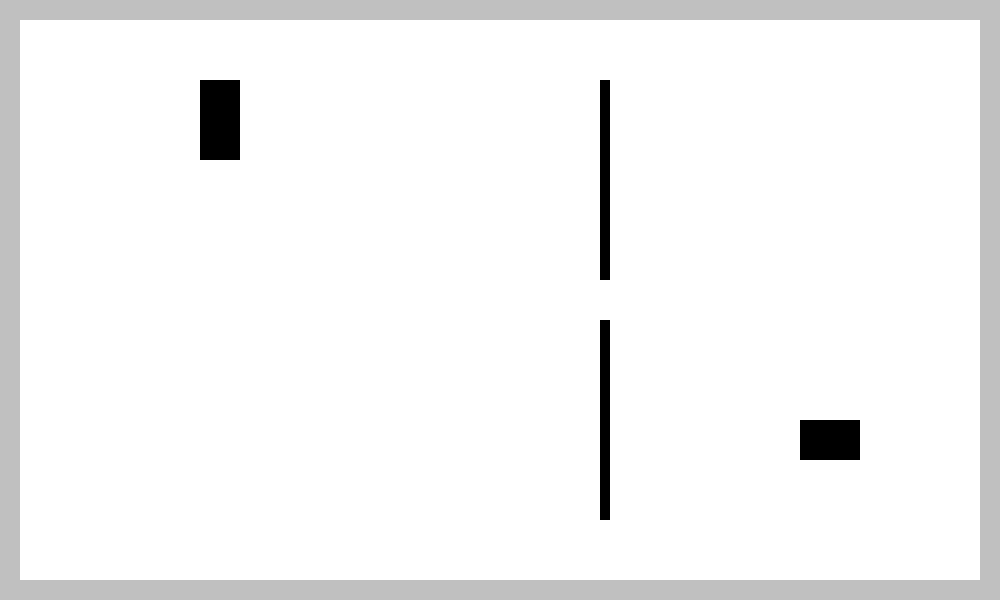

# 정상 도면 Fixture — normal-v1

관련: [공통 데이터 계약](shared-data-contract.md), [Issue #14](https://github.com/DeveloperAcademy-POSTECH/2026-C6-M15-WFFMST/issues/14)

## 목적과 범위

양쪽 앱 담당자가 **동일한 파일의 좌표·축척·최종 격자·도면 참조를 동일하게 해석하는지** 확인하는 작은 정상 샘플이다. 실제 도면이나 PoC 추출 결과가 아니라 수작업으로 규칙을 정한 합성 도면이다. 이미지와 격자는 좌우·상하 비대칭으로 만들어 반전과 행/열 혼동을 발견하기 쉽게 했다.

최초에는 파일·기대값·샘플 자체 정합성을 정의했고, 현재는 CQBCore 모델/validator로 읽는 검증까지 추가했다. 가짜 Repository, 실제 Local* 내보내기, 앱 화면 연동, 원본 동선/보정 결과는 아직 구현하지 않았다. 팀의 최종 계약 승인이나 두 기기 통신·자동 추출 정확도를 증명하지 않는다.

## 파일과 사용 방법

위치: [CQBFixtures/Resources/FloorPlans/normal-v1](../CQB/Packages/CQBCore/Sources/CQBFixtures/Resources/FloorPlans/normal-v1)

| 파일 | 역할 |
| --- | --- |
| original.png | 1000×600, sRGB·8bit 불투명 RGBA PNG, 4,841바이트 |
| resolved-mask.bin | 500×300 행 우선 UInt8 격자, 정확히 150,000바이트 |
| navigation-map.json | 공통 도면 v1 메타데이터. compact JSON 뒤 LF 하나도 hash에 포함 |
| reference.json | 도면 UUID·revision UUID·manifest 원본 바이트 hash |
| expected.json | 사람이 정한 기대값·조회 지점·두 세션 예제. 테스트 전용 형식 |

`reference.json`은 외부 도면 참조의 샘플이다. `expected.json`의 최상위 형식과 `sessions`는 테스트용이며 새 서버 문서 schema를 정의하지 않는다. 실제 전달 파일은 PNG·격자·manifest이고 참조는 세션/서비스를 통해 제공한다.

패키지는 폴더를 `.copy`로 포함해 JSON과 이진 바이트를 보존한다. CQBFixtures를 연결한 타깃은 아래 공개 API로 파일을 읽을 수 있다. 현재 MemberApp에는 제품 의존성이 있지만 InstructorApp에는 아직 없으므로, 교관 앱에서 사용하려면 후속 앱 연동 단계에서 CQBFixtures 의존성을 추가해야 한다. 이번 단계에서 Xcode 타깃 설정은 변경하지 않는다.

```swift
import CQBFixtures

let imagePNG = try NormalFloorPlanFixture.data(for: .image)
let manifestJSON = try NormalFloorPlanFixture.data(for: .manifest)
let resolvedMask = try NormalFloorPlanFixture.data(for: .mask)
let referenceJSON = try NormalFloorPlanFixture.data(for: .reference)
let expectedJSON = try NormalFloorPlanFixture.data(for: .expectations)
```

이 API는 Data를 읽기만 한다. 도면의 유효성을 보증하거나 데이터를 재인코딩하지 않는다. CQBCore decoder/validator에서 같은 파일을 입력으로 사용한다.

```swift
import Foundation
import CQBCore
import CQBImageIO

let files = FloorPlanFiles(imagePNG: imagePNG, navigationMapJSON: manifestJSON, resolvedMask: resolvedMask)
let reference = try JSONDecoder().decode(FloorPlanReference.self, from: referenceJSON)
let validator = FloorPlanValidator(imageValidator: PNGFloorPlanImageValidator())
let map = try validator.validate(files: files, reference: reference)
// map.pixelsPerMeter == 20, map.cell(at: ImagePoint(x: 100, y: 120))?.index == 30050
```

Foundation/JSONDecoder를 사용하는 위 예시는 필요한 모듈을 연결한 소비자의 호출 예시다. UI actor 밖에서 실행한다. 실제 앱 타깃에는 CQBImageIO 의존성을 아직 추가하지 않았다. 세션 도면을 읽는 호출자는 validator의 expectedReference에 세션의 고정 참조도 전달한다.

## 이미지와 격자의 정의



- 왼쪽 위 원점, 오른쪽 +x, 아래쪽 +y.
- 흰색: free. 검정: 실내 장애물. 회색: 실내 외곽 밖으로 blocked.
- 실내 외곽: 픽셀 (20,20) → (980,20) → (980,580) → (20,580).
- 정규화 외곽: x=0.02/0.98, y=1/30 및 29/30. JSON에는 유한 소수로 저장하며 픽셀 환산 검사 허용 오차는 1e-9px다. 이 오차는 Fixture 검사값이지 공통 계약의 일반 오차를 새로 정한 것이 아니다.
- 셀 크기: 2px. 각 셀의 중심으로 실내/외곽을 판정한다.
- 장애물 범위는 아래의 반개구간이다. 경계/모서리의 경로 통과 정책을 정의하는 것이 아니다.

| 영역 | 픽셀 범위 | 격자 column / row | blocked 셀 수 |
| --- | --- | --- | ---: |
| 외곽 밖 | x<20 또는 x≥980 또는 y<20 또는 y≥580 | 실내 480×280셀 이외 | 15,600 |
| 좌상단 장애물 | x=[200,240), y=[80,160) | [100,120) / [40,80) | 800 |
| 오른쪽 벽 상부 | x=[600,610), y=[80,280) | [300,305) / [40,140) | 500 |
| 오른쪽 벽 하부 | x=[600,610), y=[320,520) | [300,305) / [160,260) | 500 |
| 우하단 장애물 | x=[800,860), y=[420,460) | [400,430) / [210,230) | 600 |

벽 사이 통로는 y=[280,320), 높이 40px다. 합계는 **blocked 18,000셀 / free 132,000셀 / 전체 150,000셀**이다.

`extractionAlgorithmVersion = synthetic-normal-v1`은 실제 추출기를 실행하지 않았음을 명시한다. `rasterizationVersion = 2`는 현재 셀 중심·외곽 최종 차단 규칙을 따르는 합성 결과임을 나타내며 PoC 실행 증거가 아니다. `manuallyReviewed = true`는 등록 가능한 최종 파일의 예시값으로 작성했으며 팀 승인이나 실제 현장 검수를 뜻하지 않는다.

## 축척과 수동 기대값

- A: 정규화 (0.1,0.2) = 픽셀 (100,120)
- B: 정규화 (0.3,0.2) = 픽셀 (300,120)
- 실제 거리: 10m
- 두 점 사이 200px / 10m = **20px/m**
- 셀 한 변: 2px / 20px/m = **0.1m**

| 조회점 px | column / row | index | 기대값 | 확인 목적 |
| --- | --- | ---: | --- | --- |
| (100,120) | 50 / 60 | 30050 | free | 계약 문서의 숫자 예시 |
| (220,120) | 110 / 60 | 30110 | blocked | 좌상단 장애물 |
| (120,220) | 60 / 110 | 55060 | free | x/y 뒤바뀜 탐지 |
| (220,480) | 110 / 240 | 120110 | free | 상하 반전 탐지 |
| (604,200) | 302 / 100 | 50302 | blocked | 오른쪽 벽 |
| (604,300) | 302 / 150 | 75302 | free | 벽 사이 통로 |
| (604,340) | 302 / 170 | 85302 | blocked | 통로 아래 벽 |
| (820,440) | 410 / 220 | 110410 | blocked | 우하단 장애물 |
| (10,120) | 5 / 60 | 30005 | blocked | 실내 외곽 밖 |
| (20,20) | 10 / 10 | 5010 | free | 실내 왼쪽 위 |
| (1000,120), (100,600), (-1,120) | 없음 | 없음 | blocked | 이미지 밖: 인덱싱/자동 clamp 금지 |

이 기대값은 바이너리 생성기나 미래의 production 계산 함수로 생성하지 않고 고정했다. 점 판정 예제이며 선분 충돌 검사나 보정 경로 예제가 아니다.

## 고정 식별자와 재사용 예제

- floorPlanID: `11111111-1111-4111-8111-111111111111`
- revisionID: `22222222-2222-4222-8222-222222222222`
- sessionID A: `33333333-3333-4333-8333-333333333333`
- sessionID B: `44444444-4444-4444-8444-444444444444`

`expected.json`의 두 세션은 동일한 `reference.json`의 내용을 참조한다. 이 단계는 **두 예제의 참조가 같은지**만 확인한다. 서비스가 생성 후 변경을 거부하는지, 인증/참가 권한을 지키는지는 가짜 Repository 구현 이후 별도 테스트한다.

| 파일 | SHA-256 |
| --- | --- |
| original.png | `f23f58918733567de53483e0e1ad7147b88eda602d465710a6cba15530aa4b3f` |
| resolved-mask.bin | `31b66b78e4b08d6540cf2db9244977d5016f1394d5b67bc7214aa8534c17cfa4` |
| navigation-map.json | `1546ad93af9a824f1ae9774fa623e02c6f1ec138eba2d050e868976588b5342d` |

## 검증과 재생성

저장소 루트에서 실행한다.

```sh
# 읽기 전용: 생성 규칙과 현재 PNG/격자 바이트 일치 확인
node scripts/generate-normal-floorplan-fixture.mjs

# Bundle.module 접근, 파일 hash, 좌표/축척, 전체 격자, PNG 디코딩/방향 검증
swift test --package-path CQB/Packages/CQBCore --filter CQBFixturesTests
```

생성 소스는 [generate-normal-floorplan-fixture.mjs](../scripts/generate-normal-floorplan-fixture.mjs)다. Node 기본 모듈만 사용하며 기본 실행은 파일을 수정하지 않는다. `--write`는 PNG와 격자를 덮어쓰는 명시적인 재생성 옵션이다. JSON·기대값·hash를 자동 갱신하지 않는다. PNG 압축 바이트는 Node/zlib 버전에 따라 달라질 수 있으므로 재생성만으로 원본을 대체하지 않는다.

파일을 바꾸면 기대값·manifest hash·외부 참조·두 세션 예제를 함께 검토해야 한다. 이미 공유한 revision을 조용히 덮어쓰지 않고 변경된 샘플은 새 버전/식별자로 추가하는 것을 원칙으로 한다.

CQBFixturesTests는 샘플 자체를, CQBCoreTests의 FloorPlanValidationTests는 실제 공개 모델/validator를 검증한다. 테스트에서 손상 파일·잘못된 좌표/축척/외곽/격자·버전·참조 불일치를 만들며, 의미 검증까지 도달하도록 필요한 hash를 다시 계산한다. 실제 Local* 내보내기와 양쪽 앱 화면 표시는 다음 단계다.

```sh
# Core 소비/거부 테스트와 Fixture 정합성 테스트 전체
swift test --package-path CQB/Packages/CQBCore
```

### 실행한 검증 (2026-10-09)

- 바이너리 생성기 읽기 전용 검사: 통과.
- CQBFixturesTests: 실제 검증 6개 통과. 패키지 전체 테스트도 통과했으며 기존 CQBCoreTests의 빈 example 테스트는 계약 검증 근거에 포함하지 않는다.
- InstructorApp / MemberApp: generic iOS Simulator, CODE_SIGNING_ALLOWED=NO 빌드 통과.
- MemberApp 산출물에 Fixture 번들이 포함된 것을 확인했다. InstructorApp 빌드는 기존 동작의 빌드 회귀 확인이며 Fixture 주입/연동 검증은 아니다.
- 생성 PNG의 비대칭 배치를 시각적으로 확인했다. 실제 앱 화면에서의 표시·실기기 실행·메모리 측정·팀원 확인은 수행하지 않았다.

### 공통 코드 소비 검증 추가 (2026-10-09)

- 공개 API만 import한 Core 검증 테스트 19개 통과(일부는 여러 입력으로 매개변수화). 기존 빈 example 테스트 1개와 Fixture 정합성 테스트 6개도 통과했다.
- 정상 Fixture의 13개 조회점, 축척, 원본 바이트 유지, 정확한 hash, 좌표 왕복, 시작점 거부를 확인했다.
- 손상/CRC/잘림/투명 PNG, 이미지 크기 불일치, 필수 필드·UTF-8·1MiB 제한, 미지원 schema/좌표계/격자 인코딩, 참조 불일치, 축척·외곽·격자 오류와 취소를 검증했다.
- 홀수 이미지의 마지막 셀·외곽 선분 위 셀 중심을 확인했다. 경로 선분 통과 여부 검사는 구현하지 않았다.
- CQBImageIO, MemberApp, InstructorApp의 iOS Simulator 빌드 통과. InstructorApp은 아직 Core/Fixture/이미지 어댑터를 연결하지 않아 회귀 빌드만 확인했다.
- 파일 형식·schemaVersion 1·Fixture 원본 바이트/hash는 변경하지 않았다. 공통 모델·이미지 검증 프로토콜·검증 오류 API의 팀 승인과 노션 기록은 남아 있다.

## 담당자 확인

- [ ] 교관 담당: 도면 표시 방향·장애물·외곽·축척 기대값 확인
- [ ] 아이폰 담당: 이 파일 묶음으로 표시·시작점/방향 설정·보정 입력 구성이 가능한지 확인
- [ ] 공통 계약 검토: 파일 형식과 공개 범위 합의, 변경 기록

자동 테스트 통과로 담당자 확인을 대신 체크하지 않는다.
